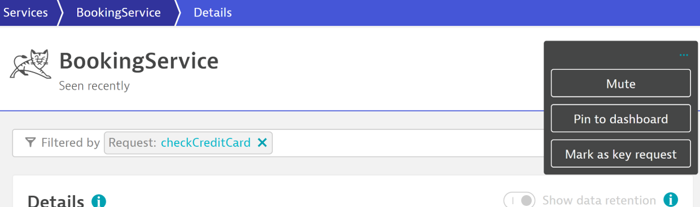

## Hands on #3 - Advanced SLO - key request - checkCreditCard

#### Situation: You are a SRE tasked with defining and tracking a SLO for a backend service that has received a lot of end-user complaints. Specifically, the checkCreditCard request has been taking a long time to return a response. After consulting with business partners and backend owners, the team has agreed on SLIs and error budgets. We want to know how many requests exceed our SLA of being under 1 millisecond. The service in question is the BookingService.

1. Identify the booking service
> - Filter on the *checkCreditCard* request

2. Mark the *checkCreditCard* as key request.



3. Navigate to data-explorer and confirm the *key request response time* metric
> - filter by Request Name: checkCreditCard


4. Navigate to the Service-level Objectives page and add a new SLO. 


5. Provide a meaningful name/metric/description for the SLO. *{ENV}\_{APP NAME}\_{HoT#}\_{ENTITY TYPE}\_{TYPE}*


SLO Name : 
```
Prod - checkCreditCard - HoT3 - Key Request - Latency
```

SLO description:
```
99.5% of credit card checks perform under 1 ms
```

SLO Metric : 
```
prod_checkcreditcard_hot3_keyrequest_latency
```


6. Set the following metric selector:

```
(builtin:service.keyRequest.response.time:avg:toUnit(MicroSecond,MilliSecond):partition("latency",value("good",lt(1))):splitBy():count:default(0))/(builtin:service.keyRequest.response.time:avg:splitBy():count)*(100)
```


7. Next, let's set the filters for the SLO.
> - Time Frame - the evaluation period of SLO. *last 30 minutes* </br>
> - Entity Selector - the entities from where SLI is calculated. *checkCreditCard* request</br>


timeFrame : 
```
-30m
```

entitySelector : 
```
type(service_method),entityName.equals("checkCreditCard")
```


8. Next, let's set our SLO target.


Target - 
```
99.5
```

Warning - 
```
99.99
```

9. Finally, preview the SLO and hit 'Create'

10. Navigate to *Dashboards* and identify the following dashboard : *Perform 2023 HoT*

11. Edit the SLO tile of the current Hands-On, and select the SLO we just created: *Prod - checkCreditCard - HoT3 - Key Request - Latency*