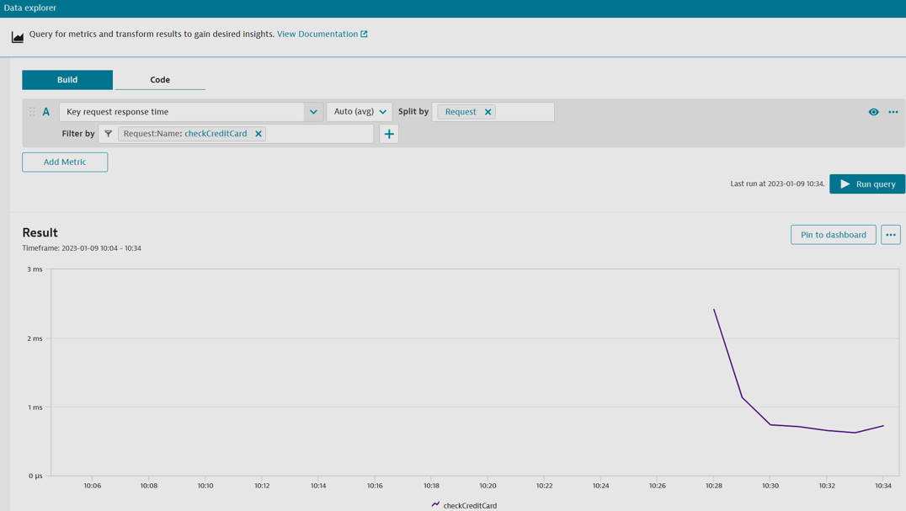
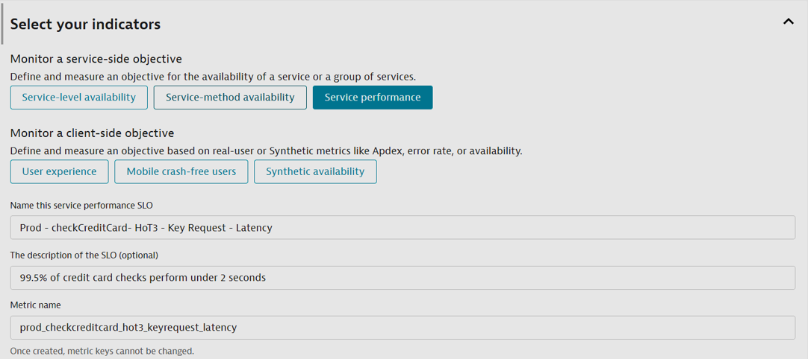
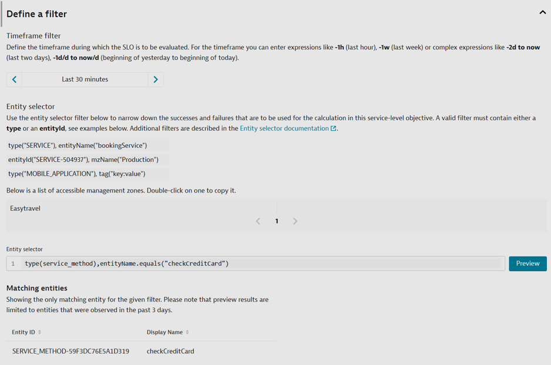

## Hands on #3 - Service

#### Situation: You are a SRE tasked with defining and tracking a SLO for a backend service that has received a lot of end-user complaints. Specifically, the checkCreditCard request has been taking a long time to return a response. After consulting with business partners and backend owners, the team has agreed on SLIs and error budgets. We want to know how many requests exceed our SLA of being under 2 seconds. The service in question is the BookingService. (com.dynatrace.easyTravel.business.backend.jar.easyTravel(x*))

1. BookingService.


9. Navigate to the SLO page found on your side menu inside Dynatrace. Second, click on Add new SLO

10. For our metric expression, we want to divide the total number of requests in breach (<=2s) by the total count of all requests of checkCreditCard. Your expression should look like this: (Note: We multiply the resulting value by 100 to get a percentage that makes sense.)

```
(100)*((calc:service.rt_checkcreditcard__2s)/(calc:service.rt_checkcreditcard_count))
```

11. We have a strict agreement with our credit card validation third party, so we’ll use a target of 99.98 and a warning of 99.99. Next, evaluate and save the SLO. 


2. Navigate to the Service-level Objectives page and add a new SLO. 



3. Provide a meaningful name/metric for the SLO. *{ENV}\_{APP NAME}\_{HoT#}\_{ENTITY TYPE}\_{TYPE}*

```
SLO Name : Prod - checkCreditCard - HoT3 - Key Request - Latency
SLO Metric : prod_checkCreditCard_hot3_KeyRequest_latency
```




5. Next, let's set the filters for the SLO.
> - Time Frame - the evaluation period of SLO. *last 30 minutes* </br>
> - Entity Selector - the entities from where SLI is calculated. *easytravel tag*</br>

```
timeFrame : -30m
entitySelector : type("SYNTHETIC_TEST"),tag(easytravel)
```


6. Next, let's set our SLO target.

```
Target - 99.99
Warning - 99.999
```



7. Finally, preview the SLO and hit 'Create'

8. Navigate to *Dashboards* and identify the following dashboard : *Perform 2023 HoT*

9. Edit the SLO tile of the current Hands-On, and select the SLO we just created: *Prod - checkCreditCard - HoT3 - Key Request - Latency*