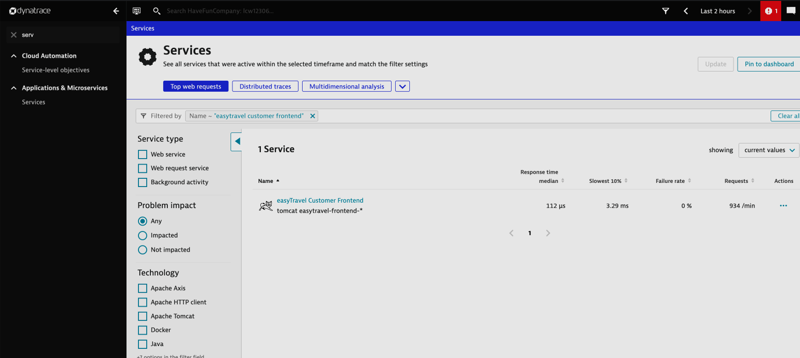
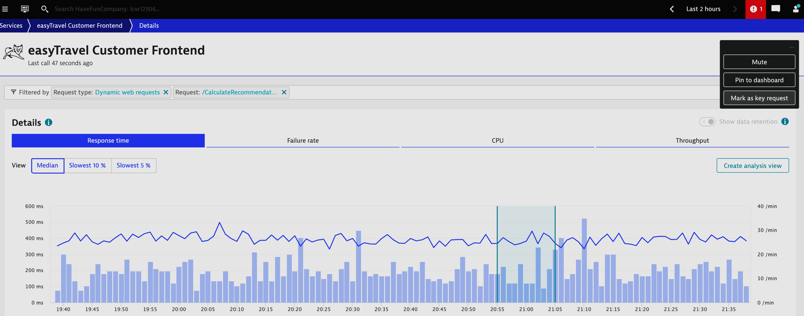
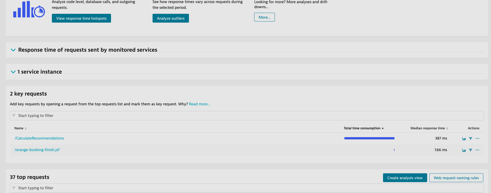
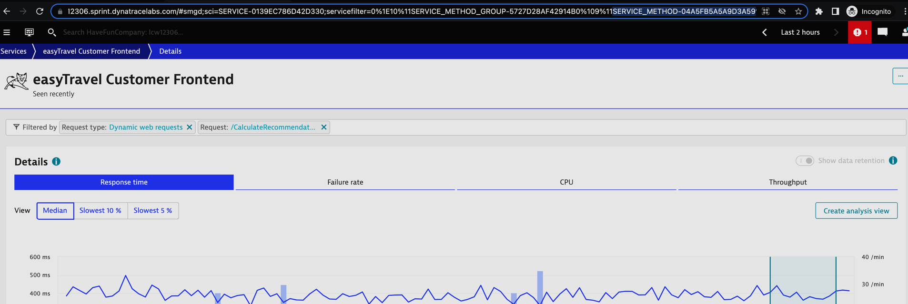
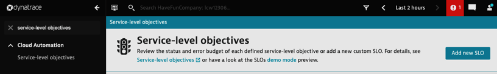
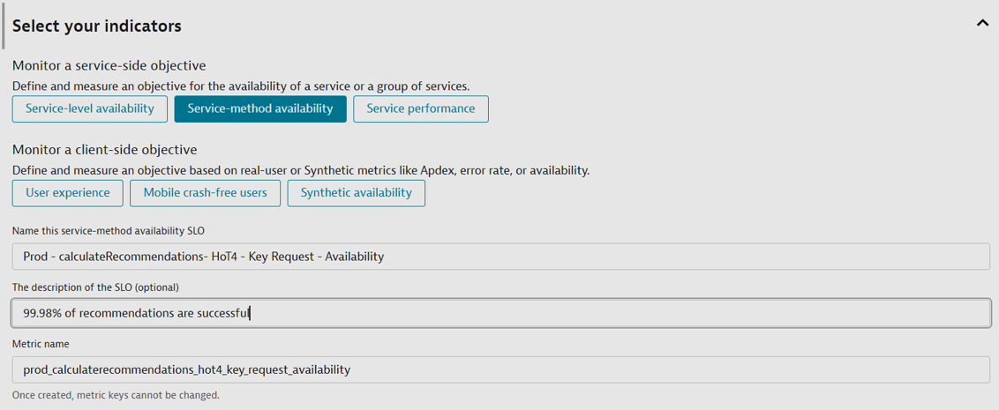
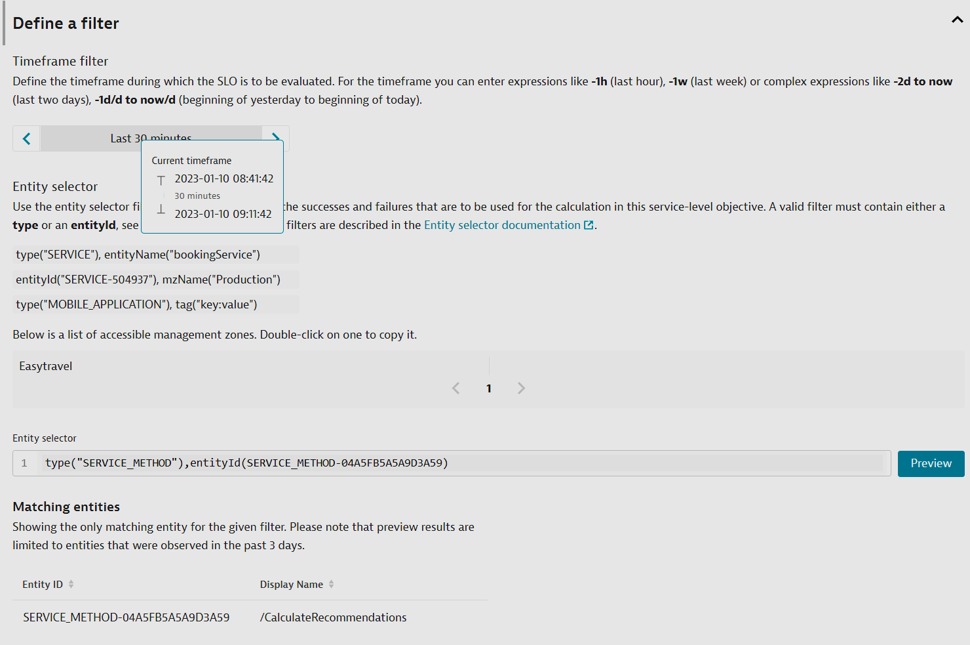
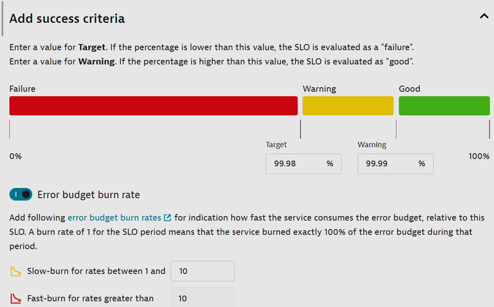

## Hands on #4 - Advanced SLO - key request - CalculateRecommendations

#### The business and dev teams have recently introduced a new function in the application that calculates travel recrecommendations for customers visiting the website. The business has determined that they want a separate, and granular SLO to track this single function, instead of the service overall (which is what we just did in the previous hands on). They want to track an SLO with a .2% error budget.In order to do this, we’ll need to: 
#### Create 2 custom metrics for our new request: Total count, and success count
#### Define an SLO with success as the numerator and total count as denominator. 

1. Navigate to Services in the left-hand menu.
> Filter for *easyTravel Customer Frontend*



2. Mark *calculateRecommendations* key request
> Filter for *calculateRecommendations*



3. Validate Key Request



4. Identify the Service Method Id
> Look in the URL for *service_method*



5. Navigate to the Service-level Objectives page and add a new SLO. 



6. Click on *Service-method availability*
> - Provide a meaningful name *{ENV} {APP NAME} {HoT#} {ENTITY TYPE} {TYPE}* </br>
> - Provide a meaningful metric *{ENV}\_{APP NAME}\_{HoT#}\_{ENTITY TYPE}\_{TYPE}*

```
SLO Name : Prod - calculateRecommendations - HoT4 - Key Request - Availability
SLO Metric : prod_calculateRecommendations_hot4_KeyRequest_availability
```




7. Next, let's set the filters for the SLO.
> - Time Frame - the evaluation period of SLO. *last 30 minutes* </br>
> - Entity Selector - the entities from where SLI is calculated. *service method id*</br>

```
timeFrame : -30m
entitySelector : type("SERVICE_METHOD"),entityId(SERVICE_METHOD-04A5FB5A5A9D3A59)
```



8. Next, let's set our SLO target.

```
Target - 99.98
Warning - 99.999
```



9. Finally, preview the SLO and hit 'Create'

10. Navigate to *Dashboards* and identify the following dashboard : *Perform 2023 HoT*

11. Edit the SLO tile of the current Hands-On, and select the SLO we just created: *Prod - calculateRecommendations - HoT4 - Key Request - Availability*