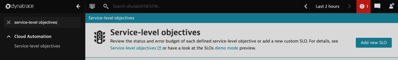
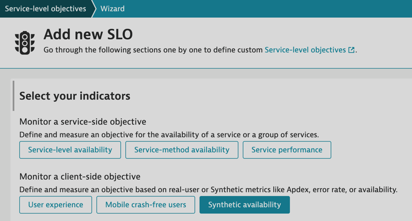
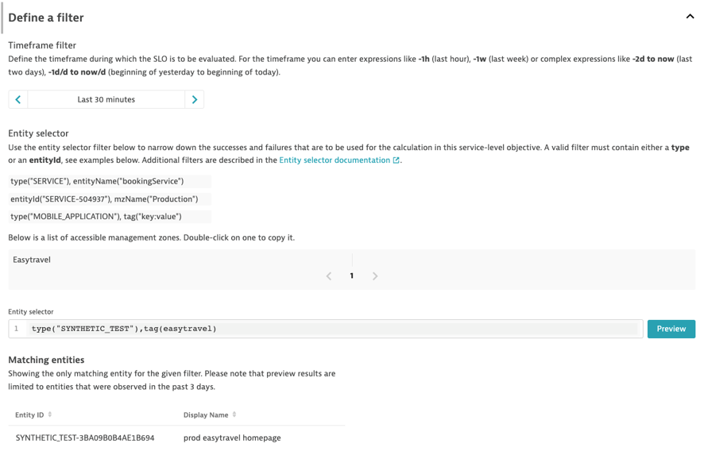
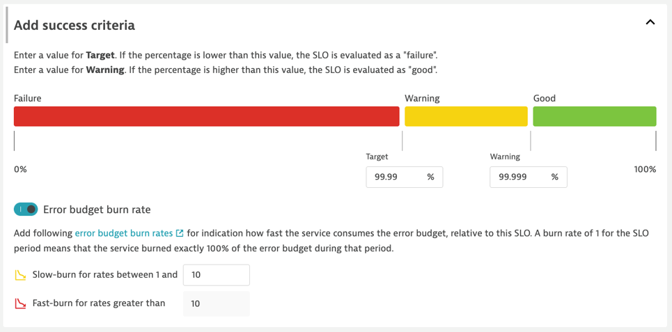

## Hands on #5 - Synthetic SLO

#### You are a SRE tasked with tracking the uptime of your teams' applications and most important workflows from an outside-in view. You should provide an overall perspective as well as availability SLOs for specific applications and application groups.

1. Navigate to the *Synthetic* page found on your side menu.
> - Evaluate the 2 Synthetic Monitors.</br>
> 1. prod easytravel homepage </br>
> 2. httpstat 503 </br>

2. Navigate to the Service-level Objectives page and add a new SLO. 



3. Click the 'Synthetic Availability' button to populate the fields below.



4. Provide a meaningful name/metric/description for the SLO. *{ENV}\_{APP NAME}\_{HoT#}\_{ENTITY TYPE}\_{TYPE}*

SLO Name : 
```
Prod - Easytravel - HoT5 - Synthetic - Availability
```

SLO description:
```
99.99% of synthetic visits are successful
```

SLO Metric : 
```
prod_easytravel_hot5_synthetic_availability
```


5. Next, let's set the filters for the SLO.
> - Time Frame - the evaluation period of SLO. *last 30 minutes* </br>
> - Entity Selector - the entities from where SLI is calculated. *easytravel tag*</br>


timeFrame : 
```
-30m
```
entitySelector : 
```
type("SYNTHETIC_TEST"),tag(easytravel)
```



6. Next, let's set our SLO target.

Target - 
```
99.99
```

Warning - 
```
99.999
```



7. Finally, preview the SLO and hit 'Create'

8. Navigate to *Dashboards* and identify the following dashboard : *Perform 2023 HoT*

9. Edit the SLO tile of the current Hands-On, and select the SLO we just created: *Prod - Easytravel - HoT5 - Synthetic - Availability*
