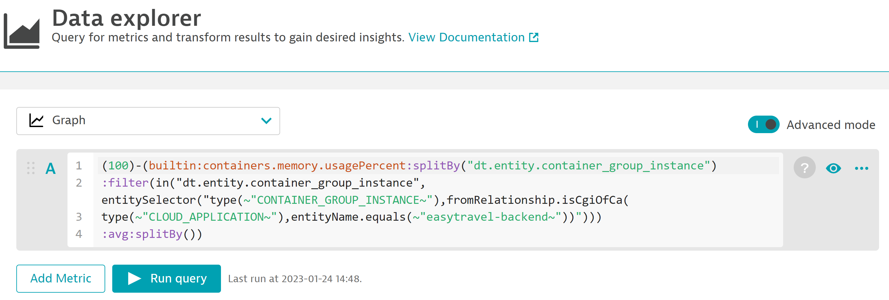
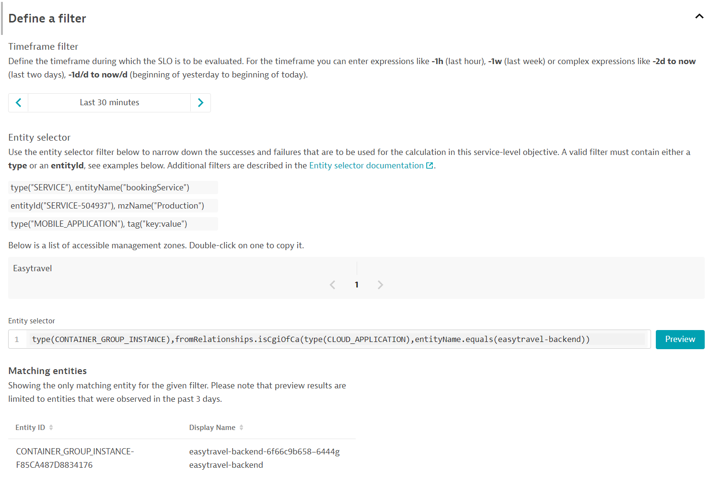
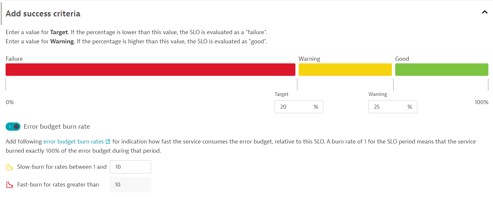

## Hands on #7 - Infrastructure SLO

#### Large Insurance Company utilizes Dynatrace SLOs to monitor their Infrastructure.  
#### Objective:
#### Evaluate the utilization of memory of Easytravel Backend Containers

1. There is no template for infrastructure SLOs, so we’ll need to use what we learned in previous exercises to define the metrics we want to use as part of our SLO definition.

2. Navigate to *Observe and explore* > *Data Explorer* and switch to *code*
> - add the following meteric selector:

```
(builtin:containers.memory.usagePercent:avg:splitBy())
```

> This metric visualizes the average memory usage percent of containers.

3. We need to filter this metric to the *Easytravel Backend Containers*
> - replace the metric selector with the following:

```
(builtin:containers.memory.usagePercent:splitBy("dt.entity.container_group_instance")
:filter(in("dt.entity.container_group_instance", entitySelector("type(~"CONTAINER_GROUP_INSTANCE~"),fromRelationship.isCgiOfCa(
type(~"CLOUD_APPLICATION~"),entityName.equals(~"easytravel-backend~"))")))
:avg:splitBy())
```

> Now only the Easytravel Backend container memory usage percent is shown.

4. This is good, however we need the opposite (memory usage percent remaining)
> - add the following to the front of the metric selector

```
(100) - 
```

> Now we have the correct indicator for our SLO.



5. Navigate to the Service-level Objectives page and add a new SLO. 

6. Provide a meaningful name/metric for the SLO. *{ENV}_{APP NAME}_{HoT#}_{ENTITY TYPE}_{TYPE}*

```
SLO Name : Prod - Easytravel Backend - HoT7 - Container - Saturation
SLO Metric : prod_easytravelbackend_hot7_container_saturation
```

7. Set the metricselector to:

```
(100)-(builtin:containers.memory.usagePercent:avg:splitBy())
```


8. Next, let's set the filters for the SLO.
> - Time Frame - the evaluation period of SLO. *last 30 minutes* </br>
> - Entity Selector - the entities from where SLI is calculated. *workload name*</br>

```
timeFrame : -30m
entitySelector : type(CONTAINER_GROUP_INSTANCE),fromRelationships.isCgiOfCa(type(CLOUD_APPLICATION),entityName.equals(easytravel-backend))
```



9. Next, let's set our SLO target.

```
Target - 20.00
Warning - 25.00
```



10. Finally, preview the SLO and hit 'Create'

11. Navigate to *Dashboards* and identify the following dashboard : *Perform 2023 HoT*

12. Edit the SLO tile of the current Hands-On, and select the SLO we just created: *Prod - Easytravel Backend - HoT7 - Container - Saturation*