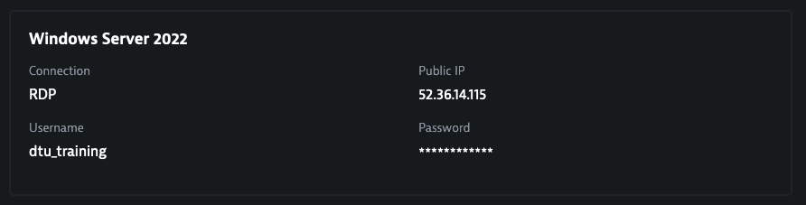

## Explore insecure-bank

### Access the environment

In Dynatrace University, open the *Environment* section.

You should see a section called Ace-Box with SSH credentials. You can use the built-in terminal to access it, we only need to log in to get the details to access the environment. 

Click on *Open Terminal*

Navigate to the Dashboard URL (http://dashboard.dtulab.......dynatrace.training) and log in using the provided credentials.

The dashboard contains the links for the Dynatrace environment (you should already have received an invitation for that) and the insecure-bank application. For this hands-on, we will only need to access insecure-bank. We will use the Dynatrace environment later. 

Click on the insecure-bank tab and then on the insecure-bank link. 

| Since we are going to launch injection attacks on this application, it is recommended to connect to the provided Windows host to access the insecure-bank website
In your environment details in the Dynatrace University you will find connection information to connect to a Windows instance using RDP. Use any RDP client to open a connection, on Windows there is probably already one installed, on Mac you can download it from the App Store. 

Once you connected to the Windows instance, use the insecure-bank URL from the dashboard.

### Insecure-bank
Insecure-bank is a demo application that has several security flaws. Take some time to explore the application and see if you can find a way to bypass the login. 

| Objectif: find a way to access one of the accounts without using the correct credentials.

| **HINT**
| There are two accounts on insecure-bank. You can use the following credentials to access them, but the goal is to get access without providing a password. 
| - john / test
| - doug / test