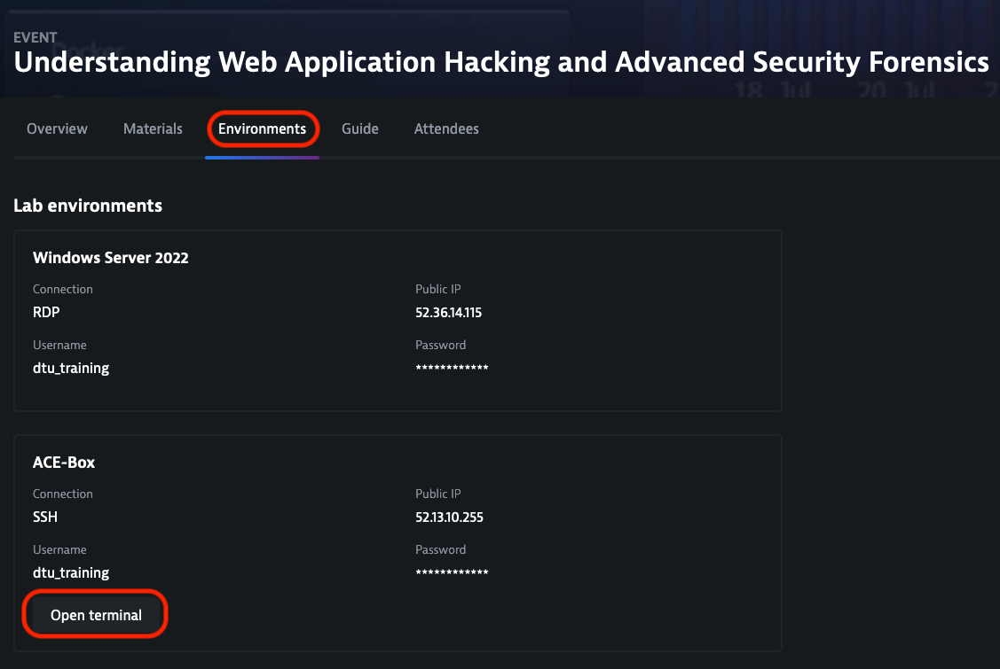

## Launch an attack on insecure-bank

Navigate back to the insecure-bank application
- You can bypass the login using a SQL-injection: enter `'or 1=1--` in the username field
  - You can add your name (or another identifier) before at the beginning or at the end to see if you can find your attack in Dynatrace

## See how Dynatrace detected your attack
Open to the Dynatrace instance and got to *Application Security > Attacks*. 

In Dynatrace University you will find the information on how to access the Environment required for the lab. Please make sure you can:
- Access the Dynatrace Environment using a web browser
- Connect to the bastion host using SSH

### Explore the insecure-bank application

Access the insecure-bank application and start to explore it
- you can login to the application using the following credentials
  - john / test
  - doug / test