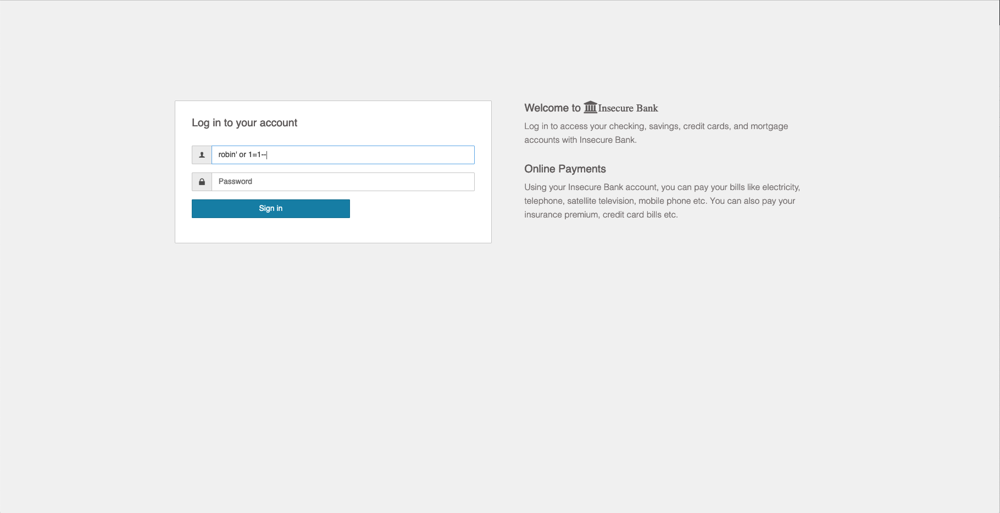
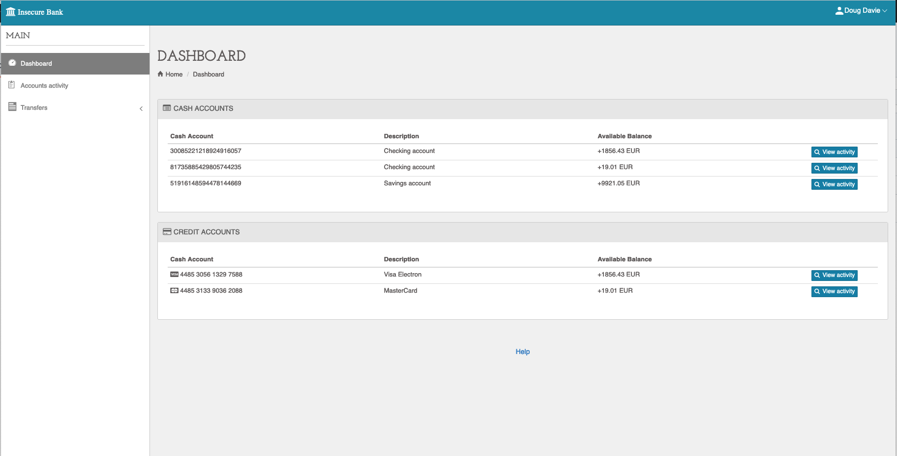
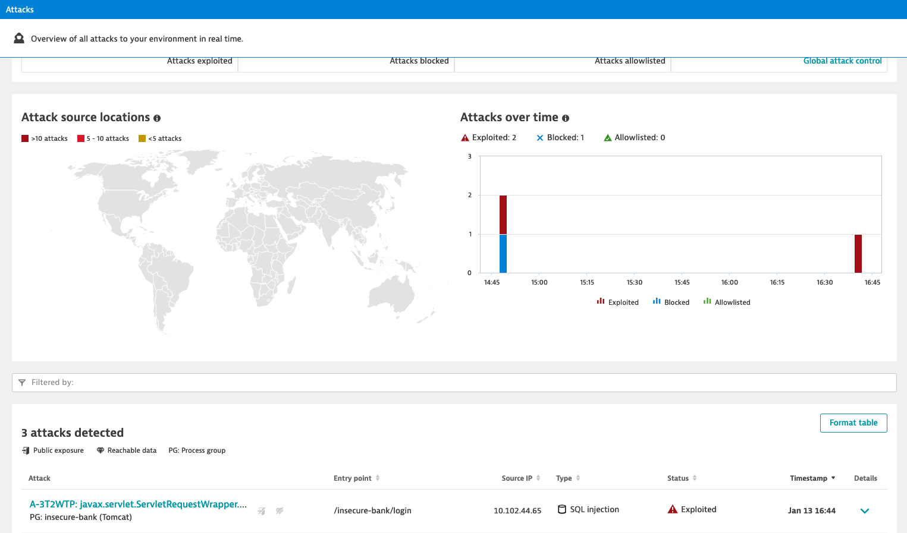
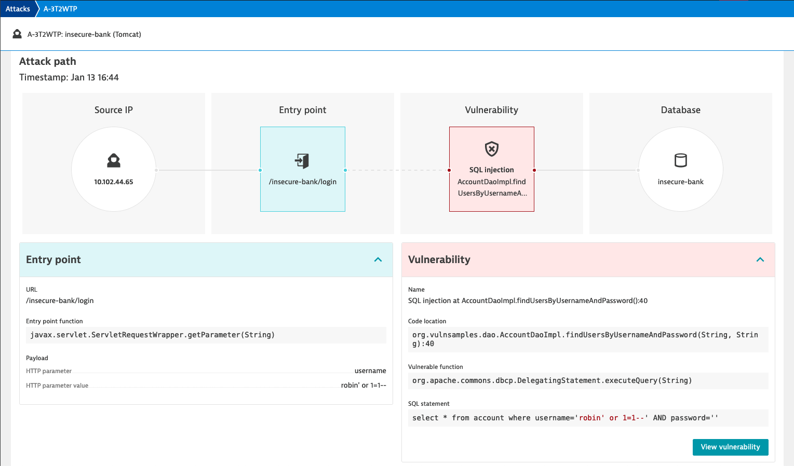

## Launch an attack on insecure-bank

Navigate back to the insecure-bank application
- You can bypass the login using a SQL injection: enter `'or 1=1--` in the username field

| Tipp: Add your name (or another identifier) before at the beginning or at the end to see if you can find your attack in Dynatrace (for example  `robin'or 1=1--`)

## See how Dynatrace detected your attack
Open the Dynatrace instance and go to *Application Security > Attacks*. 
- https://sik90165.sprint.dynatracelabs.com

| You should have received a link for the Dynatrace environment via email. 

You will see all the attacks that Dynatrace detected, since we all use the same Dynatrace instance, you will see the attacks of the other participants. Try to find the one that you executed. 

