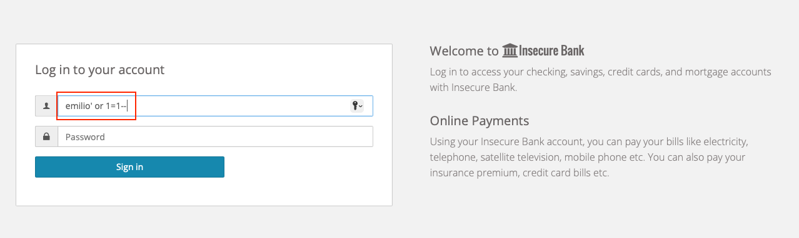

## Detecting Attacks

### PART 1

#### Launch an attack on insecure-bank

- Navigate back to the insecure-bank application login page.

- You can bypass the login using a SQL-injection: enter `name'or 1=1--` in the username field, you add your name in the injection statement to look for your attack later in this lab.

- You're in!

### PART 2

#### See how Dynatrace detected your attack

- Now open the Dynatrace instance and go to *Application Security > Attacks* menu. 
You will see all the attacks that Dynatrace detected, since we all use the same Dynatrace instance, you will see also the attacks of the other participants.

- Try to find the one that you executed (identified by your name in the statement) and observe other attacks too. 

As you can observe, your attack has been detected by Dynatrace and... exploited; thus you obtained the Insecure Bank dashboard.

### PART 3

#### See how Dynatrace blocks your attack

It is time to block these dangerous attacks, protecting the Insecure Bank application.

As soon as you will be notified by the instructor:

- logout from Insecure Bank.

- You can bypass the login using a SQL-injection, again: enter `name'or 1=1--` in the username field as you did in the first exercise.

- Ops! Please carefully observe the error page.

- Open the Dynatrace instance again and go to *Application Security > Attacks* menu.

- Take note about the different action/actions that Dynatrace took to protect from the attack, if any.
