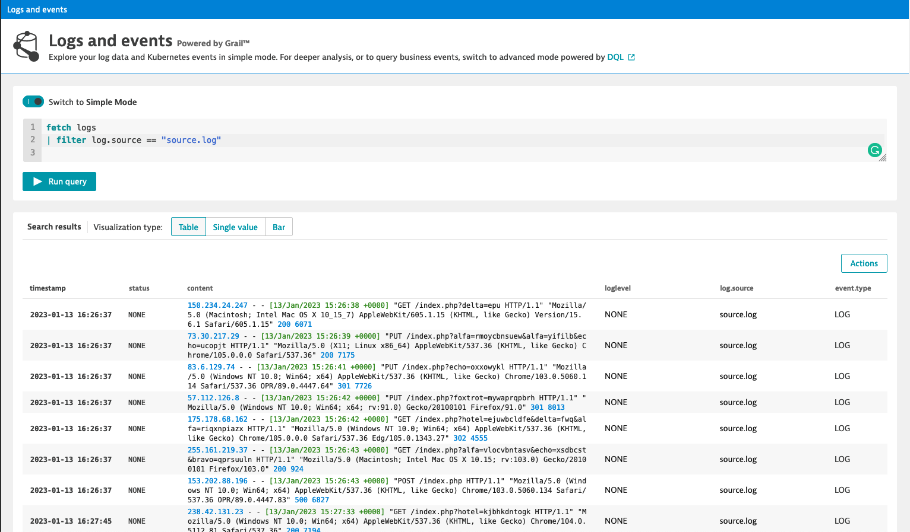
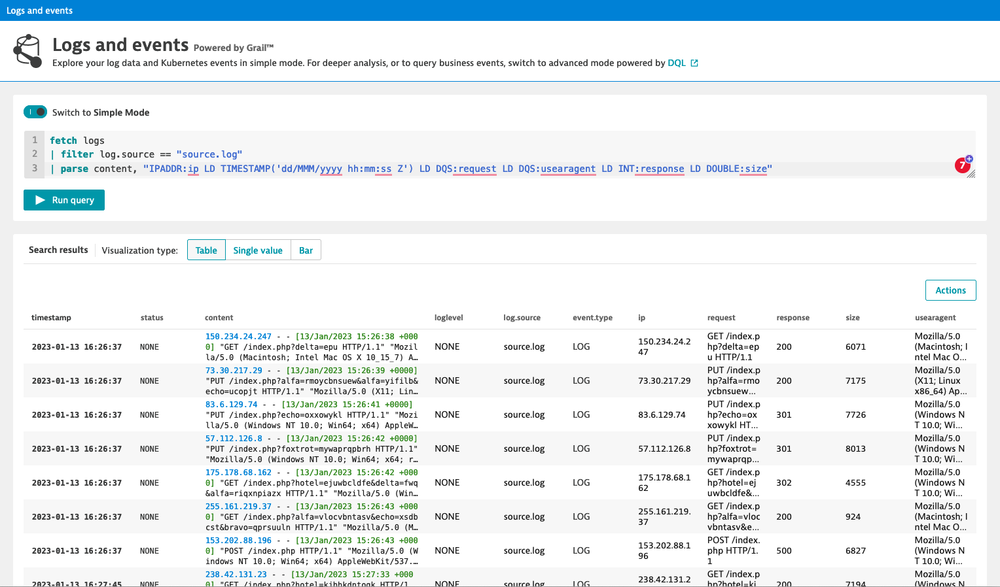

## Hello DQL

## Your first query
Open the Dynatrace instance and go to *Observe and explore > Logs*, make sure that you are in the advanced mode (toggle at the top) and execute the following query:
```
fetch logs
|  filter log.source == "source.log"
```



## Parse this
Break the content field into several, more useful fields, by adding the following command to your query:

```
| parse content, "IPADDR:ip LD TIMESTAMP('dd/MMM/yyyy hh:mm:ss Z') LD DQS:request LD DQS:usearagent LD INT:response LD DOUBLE:size"
```

The full query should no be:
```
fetch logs
| filter log.source == "source.log"
| parse content, "IPADDR:ip LD TIMESTAMP('dd/MMM/yyyy hh:mm:ss Z') LD DQS:request LD DQS:usearagent LD INT:response LD DOUBLE:size"
```
