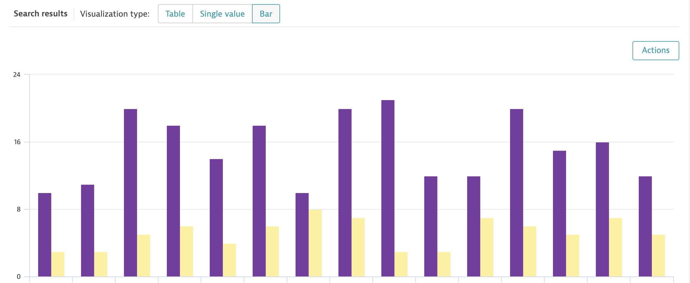

## Hello DQL

## Your first query
Open the Dynatrace instance and go to *Observe and explore > Logs*, make sure that you are in the advanced mode. 

Your task is to compile a query which:
- retrieve logs from timeframe of last 60 days
- includes only records from `log.source == "source.log"`
- extracts `event_time` from `content` field : `parse content, "LD HTTPDATE:event_time"`
- uses only fields `event_time` and `content` 
- records are sorted in ascending manner by `event_time`

1. compute the total count of the records
2. compute timeline of the counts of GET and POST requests per 1 minute timeslots. Visualize it using bar diagram.

*Hint:* here's how to utilize conditional counting:
```
fetch logs, from:-60d
| filter log.source == "example.log"
| parse content, "LD HTTPDATE:event_time"
| fields event_time, content
| sort event_time asc
| summarize get=countIf(contains(content,"GET")), post=countIf(contains(content,"POST")), by:{bin(event_time, 1m)}
```

