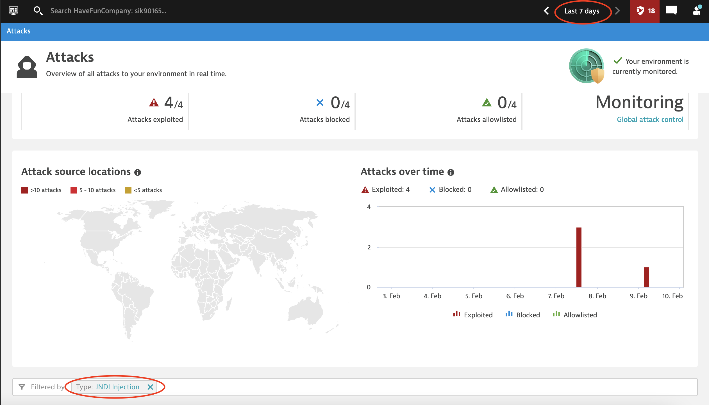

## Using Grail and DQL to Investigate an Incident

### Example Queries for Insecure Bank logs.
Modify or add new commands to these example queries to perform your investigation.

#### access log:
```
fetch logs, from:-90d, samplingRatio:1, scanLimitGBytes:-1
| filter dt.entity.host == "HOST-C6360D34D50CFC64"
| filter contains(log.source, "insecure-bank-access.log")
| parse content, "IPADDR:client_ip LD HTTPDATE:event_time LD DQS LD DQS ' ' DQS ' ' LD:session_id EOS"
| fields event_time, client_ip, session_id, content
| sort event_time asc
```

#### web application log:
```
fetch logs, from:-90d, samplingRatio:1, scanLimitGBytes:-1
| filter dt.entity.host == "HOST-C6360D34D50CFC64"
| filter contains(log.source, "insecure-bank-webapp.log")
| parse content, "'[' TIMESTAMP('dd/MMM/yyyy:HH:mm:ss.S'):event_time LD '} - ' LD:session_id ' '"
| fields event_time, content
| sort event_time asc
```

#### database log:
```
fetch logs, from:-90d, samplingRatio:1, scanLimitGBytes:-1
| filter dt.entity.host == "HOST-C6360D34D50CFC64"
| filter contains(log.source, "insecure-bank-sql.log")
| parse content, "TIMESTAMP('yyyy-MM-dd HH:mm:ss.S'):event_time ' 3 ' LD:statement"
| fields event_time, statement
| sort event_time asc
```

### Exercise 1: Investigate following customer complaint and provide evidence from logs:

```
Dear Insecure Bank Customer Support,

I have discovered an illegal funds transfer from my account, see attached account statement. 
Please investigate and return the money to my account as soon as possible.

Jonathan Stafford
```


#### Step 1: Investigate the details of customer reported transaction:
1. **Was the account accessed illegally?**
2. **If so, then how exactly was this carried out?** 
   
   Find out as many details as possible: actual sql statement used to authenticate end-user, originating ip-address, 
   user agent, etc.
3. **What actions did attacker do?**

Start with querying application log. Use `event_time` field to filter for the time of reported transaction.
- find the beginning and the end of the session
- how was end-user authenticated?
- what actions did attacker do?

After that use database and access logs to find the actual sql statement and attacker ip-address.

#### Step 2: Assess the damage
1. **Have any other customers been hit by the same attack?** 
   
   Use application logs to find out *all login records* bearing signs of sql injection (i.e database returning more than 1 records) 
   Make note of respective session_id's and session beginning and end timestamps.

2. **What is total financial loss?**

   You'll need to look into database logs to see additionally incurred costs.
   Use session begin and end timestamps to in the filter command to see appropriate log records.

   *Hint:* use function [`toTimestamp()`](https://www.dynatrace.com/support/help/how-to-use-dynatrace/dynatrace-query-language/functions#to-timestamp)
3. **How long have the attacks been around and when did they start?**

   To find out the beginning of sql-injection attacks we need to find out both successful as and unsuccessful attempts.
   Look for log records containing `Starting findUsersByUsernameAndPassword` in the message and look for the signs of
   sql injections in the username: multiple words, sql-style comments, single-quotes, etc.

   Modify `parse` command in the example query as follows: 

   ```
   | parse content, "'[' TIMESTAMP('dd/MMM/yyyy:HH:mm:ss.S'):event_time LD '} - ' LD:session_id ' ' 'Starting findUsersByUsernameAndPassword of user: ' LD:username EOS"
   ```

   *Hint:* use [`sort`](https://www.dynatrace.com/support/help/how-to-use-dynatrace/dynatrace-query-language/commands#sort) command to find the earliest timestamp.
4. **Are the attackers same?** 
   
   To select all records with attacker ip-addresses use the session_id's from query 2.1 result.

   *Hint:* use [`summarize count() by: client_ip`](https://www.dynatrace.com/support/help/how-to-use-dynatrace/dynatrace-query-language/commands#summarize) command to get unique ip-addresses.

#### Step 3: Assess similar threats
1. **Has there been other type of attacks trying to get access to accounts?**  

   When attacker is trying out an attack, it most likely has success ratio which is very different from legitimate usage.

   Hence, we can start with comparing login attempt success ratio's between ip-addresses. The easiest is to compute total 
   and failed attempts (these are present in the access log directly)
   
   *Hint:* compute total and failed counts of login attempts using [`summarize total=count(), failed=countIf(contains(content, "/insecure-bank/login?authenticationFailure=true")), by: client_ip`](https://www.dynatrace.com/support/help/how-to-use-dynatrace/dynatrace-query-language/commands#summarize) command to get unique ip-addresses. 
   
   Next, try to visualize the timing pattern of attackers failed attempts: by counting them per 1 minute intervals.  
   Any obvious signs of regularity indicates the use of automation and consequently also the conscious intent behind it.

   *Hint:* use [`summarize failed=countIf(...), by:bin(event_time, 1m)`](https://www.dynatrace.com/support/help/how-to-use-dynatrace/dynatrace-query-language/commands#summarize) command
2. **Which users were targeted?**
   
   Finding out the usernames gives you understanding if the attack was targeted or a generic scanning.

   Use application logs to find records indicating failed login result `No users found` 

   Modify `parse` command in the example application log query as follows:

   ```
   parse content, "LD 'username: ' LD:username EOS"
   ```

   Then use `summarize` command to compute count of usernames.

### Exercise 2: Investigate jndi injection attack:

#### Step 1. Open the Dynatrace instance and go to "Application Security > Attacks" 

You will see all the attacks that Dynatrace detected, since we all use the same Dynatrace instance, you will see the 
attacks of the other participants. Try to find jndi injection attack which occurred from IP-address 10.0.1.203

*Hint:* use filtering bar to specify IP-address


Select the attack details and observe the attack vector:


Next let's see all process-related logs: click on "View all process-related logs".

Switch to "Advanced mode" and modify the query by adding:
```
| fields timestamp, log.source, content
```
You can see that the database has logged the attack vector correctly while vulnerable Java application has logged it as 
a runtime class reference. This confirms that the payload was executed by insecure bank application.


#### Step 2. Investigate attacker actions by examining audit logs
Quick intro to Linux auditd logs:


Execute following query:
```
fetch logs, from:-90d, samplingRatio:1, scanLimitGBytes:-1
| filter contains(log.source,"audit") AND matchesValue(dt.entity.host, "HOST-C6360D34D50CFC64")
| parse content, "
   'type=' LD:event_type ' '
   'msg=audit(' TIMESTAMP('s.S'):event_time ':' INT:id '):' ' '?
   ARRAY{WORD (' ' | ', ')}{0,10}
   KVP{
      [-a-zA-Z0-9_\\[\\] ]+:key
      '='
      (SQS|('{'LD'}')|LD):value ('\\x1d' | (>>' ') |(>> (' ' [-a-z0-9_\\[\\] ]+ '='))| (>> EOS)) ' '?
   }{0,256}:event_attr
"
| fields event_time, id, event_type,
         syscall=event_attr[SYSCALL], success=event_attr[success], 
         pid=event_attr[pid], ppid=event_attr[ppid], 
         cmd=event_attr[comm], exe=event_attr[exe]
         ,content
| filter event_type=="SYSCALL"
| filter in(ppid,"36603") //insecure-bank java process id
| sort id, event_time
```

You should see all `SYSCALL` records executed by insecure bank java process. As you can see they're all executing system 
call [`execve()`]'(https://www.google.com/url?sa=t&rct=j&q=&esrc=s&source=web&cd=&cad=rja&uact=8&ved=2ahUKEwiJlLX63s78AhUOiYsKHfvgDVgQFnoECAsQAQ&url=https%3A%2F%2Fman7.org%2Flinux%2Fman-pages%2Fman2%2Fexecve.2.html&usg=AOvVaw2tz4jrlcx0fddRr4wYEjXf), 
executing command `sh`.

To see more details of each executed command, run following query:
```
fetch logs, from:-90d, samplingRatio:1, scanLimitGBytes:-1
| filter contains(log.source,"audit") AND matchesValue(dt.entity.host, "HOST-C6360D34D50CFC64")
| parse content, "'type=' LD:event_type ' ' 'msg=audit(' TIMESTAMP('s.S'):event_time ':' INT:id"
| fields event_time, id, content
| filter in(id, ...) //paste here id’s from previous query
| filterOut contains(content, "type=UNKNOWN") 
| sort id, event_time
```

Examine `EXECVE` records of all id's. Use [this hex-decoder](https://cryptii.com/pipes/hex-decoder) to decode `a1` 
parameter value (holding the command arguments). 

You can also decode `PROCTITLE` record `proctitle` value and compare it to the `EXECVE` record data.

Finally, you should be able to get the details of all commands executed by attacker through the backdoor.  
