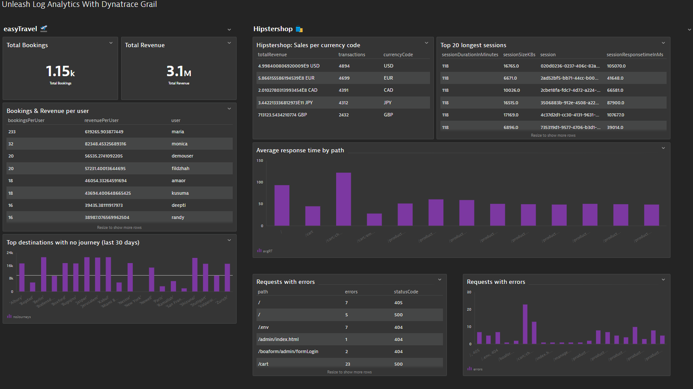

# Lab Introduction

The following labs will teach the most crucial skills of the Dynatrace Query Language. The goal is to learn DQL by putting it in real world practice! We'll teach each concept by creating dashboard tiles which will build out a multi application business and troubleshooting focused view!

