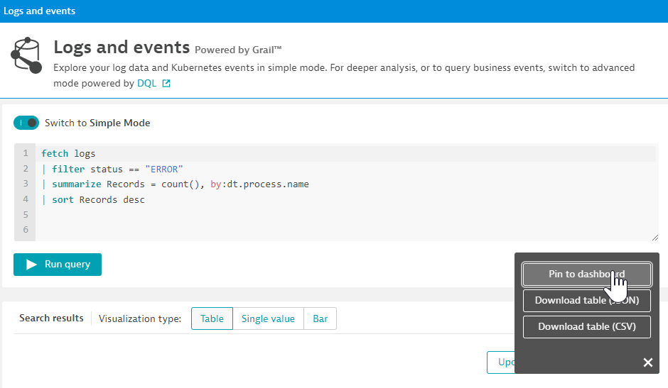
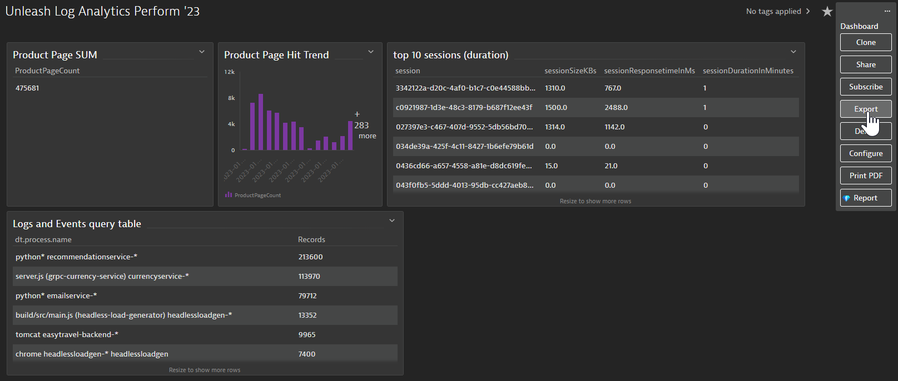

## Lab Introduction

The following labs will teach the most crucial skills of the Dynatrace Query Language. The goal is to learn DQL by putting it in real world practice! For each lab exercise completed, you can follow the below steps to build a dashboard. This dashboard can be exported at the end of the session so you can save the queries built and reference them for later. Noting that some of the queries may not work in other environments than this HOT session but the structure written is excellent learning and reference for future query building!

There will be 4 individual labs with some instructor lead demonstration of additional features and concepts to follow.

When you've built a complete DQL query, pin the results to a dashboard by selecting actions and 'Pin to dashboard':

To export the dashboard as a reference to the DQL queries at a later time, open the dashboard and select the `...` icon in the upper right to export:

The export will download a json file to your local machine. You can then import this dashboard into any Dynatrace tenant.
