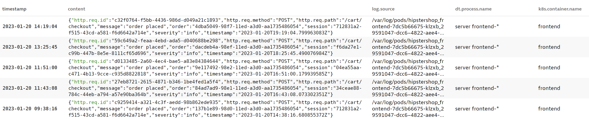
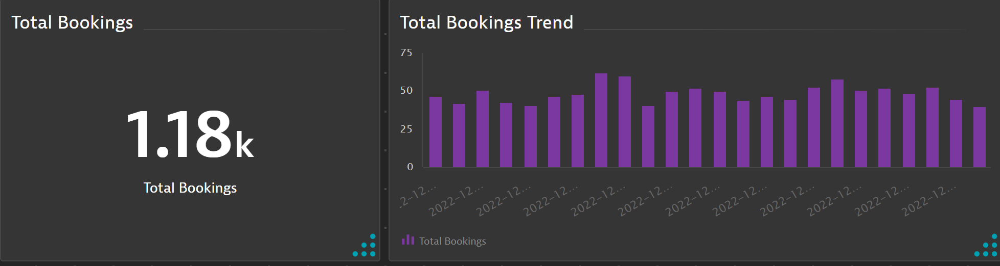
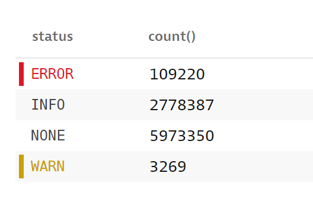

## Observe aggregates over time and summarize in DQL

This lab is designed to explore common use-cases for aggregating data and viewing trends. After building each query pin the results to a dashboard which you can later export for review of the queries built in each lab.

## Introducing the Summarize command

Let's assume you've been tasked to report the total confirmed order counts in the HipsterShop Ecommerce application. You track down a developer and ask if there's any log that would write such information. The developer suggests to look at the frontend container log which writes entries for each HTTP request and also includes metadata confirming the action type (view cart, order placed, etc..).

Information known:

- The container name 'frontend' is the container writing logs for the information needed.
- Only interested in entries that have the action 'order placed' present.

### Step 1 - Filter log records

Starting with the below DQL query, create appropriate filters to find the relevant log entries for the requirements above.

```
fetch logs, scanLimitGBytes:500, samplingRatio:1000
| fields timestamp, content, log.source, dt.process.name, k8s.container.name
| sort timestamp desc
```

<h2><details>
    <summary>Click to Expand Solution</summary>

```
fetch logs, scanLimitGBytes:500, samplingRatio:1000
| fields timestamp, content, log.source, dt.process.name, k8s.container.name
| filter k8s.container.name == "frontend" AND matchesPhrase(content, "Order placed")
| sort timestamp desc
```

</details></h2>

### Step 2 - Verify results

The results should look similar to the screenshot below:



### Step 3 - Get the total count

Now that we have the records matching the requirements it's time to aggregate them together for a total count in the time period. Since each record represents a customer order the goal is to sum the count of all records.

To aggregate any results, we'll use the `summarize` command in DQL.

### Helpful Link: [Summarize Command documentation](https://www.dynatrace.com/support/help/how-to-use-dynatrace/dynatrace-query-language/commands#summarize)

Modify the current query to show a total count of customer orders placed and include a custom column name for the count. Now that we want exact results, we'll remove the scanLimitGB & samplingRatio from the query.

<h2><details>
    <summary>Click to Expand Solution</summary>

```
fetch logs
| fields timestamp, content, log.source, dt.process.name, k8s.container.name
| filter k8s.container.name == "frontend" AND matchesPhrase(content, "Order placed")
| summarize `Customer Orders` = count()
```

</details></h2>

### Step 4 - Pin the results to a new dashboard

Pin the Customer Order count to a new Dashboard called 'Unleash Log Analytics Perform 2023'

### Step 5 - Show 5 minute trend of total orders

We've built a DQL query that will show the total orders for any time period requested. We can also show the same results as a trend over some aggergation of time using the `by:` command within the summarize pipe.

Navigate back to the log viewer and query the same results as in step 3.

Modify the query to show the total number of errors for each 5 minute aggregation for today's timeframe.

Reference the summary command documentation above for usage of the `bin` function within the `by:` command.

<h2><details>
    <summary>Click to Expand Solution</summary>

```
fetch logs
| fields timestamp, content, log.source, dt.process.name, k8s.container.name
| filter k8s.container.name == "frontend" AND matchesPhrase(content, "Order placed")
| summarize `Customer Orders` = count(), by: bin(timestamp, 5m)
```

</details></h2>

### Step 6 - Pin to dashboard

Finally, change the visualization type to 'bar' and pin the results to the same 'Unleash Log Analytics Perform 2023' dashboard.



## Bonus Exercises

1. Build a DQL query that produces a count of all records grouped by status and ensures the status field is not null.

_Note that values in the image below are expected to differ from your results_



2. Build a DQL query that finds the top process name with the most error records in the last 24 hours (using dql to specify the timeframe). Sort the table by descending order. Hint - your filter should be ERROR (case sensitive).

_Note that values and process names in the image below are expected to differ from your results._


