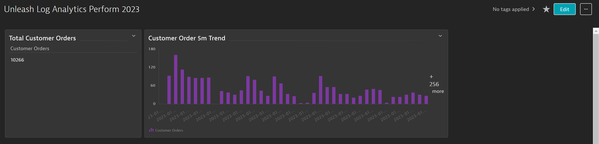

# Observe aggregates over time and summarize in DQL

This lab is designed to explore common use-cases for aggregating data and viewing trends. After building each query pin the results to a dashboard which you can later export for review of the queries built in each lab. 

## Introducing the Summarize command

Let's assume a developer of our application EasyTravel states there is a log entry from the backend process which needs to be summed for a period of time. The record has a URI path in its content field which identifys a new booking has occured on our application. We woud like to build a query that generates a total value for the number of matching records in a given time period. 

The *phrase* to match records by = "GET /Payment/Pay"

Starting with the following query, filter records which contain the above phrase. Also build the query so it only returns the timestamp and content fields.

```
fetch logs
```
The log viewer results should look be similar to the image below:


If you were successful with your filter the resulting query should currently be:

```
fetch logs
| filter matchesPhrase(content, "GET /Payment/Pay")
| fields timestamp, content
```
Since each record indicates a booking request, the objective is to display a SUM of total requests for any timeframe.

In DQL, to count the records we'll use the `summarize` command and call the `count()` function. In order to include a proper name for this count we'll first need to create a variable:

```
fetch logs
| filter matchesPhrase(content, "GET /Payment/Pay")
| fields timestamp, content
| summarize `Total Bookings` = count()
```

Change the DQL Result visualization to Single Value and pin the result to a new dashboard called "Unleash Log Analytics"

Now, if we would also like to show the total booking requests by some time-based interval, we can add `by:` to the `summarize` command to aggregate the results by a specific field. 

From the dashboard you just created click the arrow down of the upper right hand corner of the Total bookings tile and select 'view details' to return to the log viewer results for that DQL Query.


Edit the query to include the `by:` aggregate as shown below:

```
|summarize `Total Bookings` = count(), by:{bin(timestamp, 5m)}
```

In the results select the visualization 'Bar' and then click 'Actions' and 'Pin to Dashboard' to create a new tile on the same dashboard you just created.

Your dashboard should now look similar to the image below (your numbers may be different):



## Bonus Exercises

1. Build a DQL query that produces a SUM of all records grouped by status and ensures the status field is not null.

*Note that values in the image below are expected to differ from your results*


2. Build a DQL query that finds the top process name with the most error records in the last 24 hours (using dql to specify the timeframe). Sort the table by descending order. Hint - your filter should be ERROR (case sensitive).

*Note that values and process names in the image below are expected to differ from your results.*


