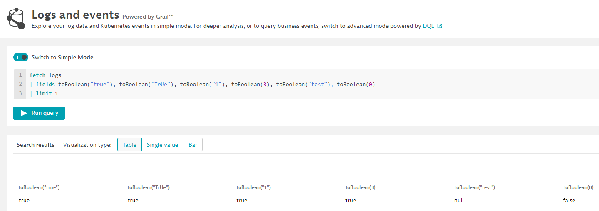
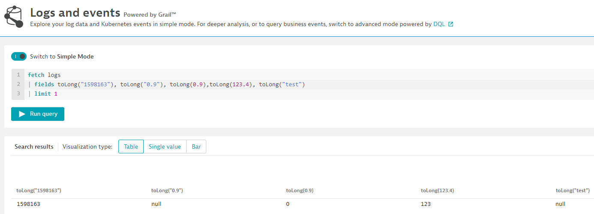
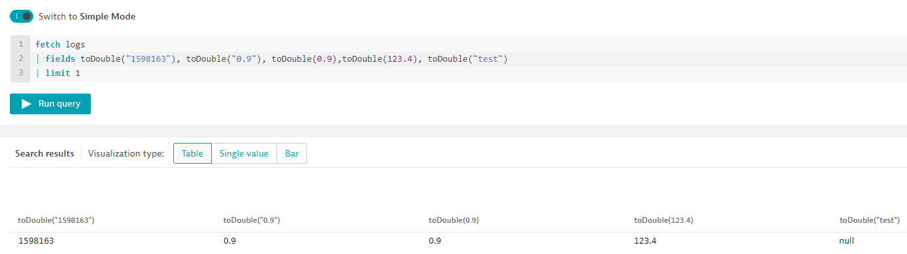
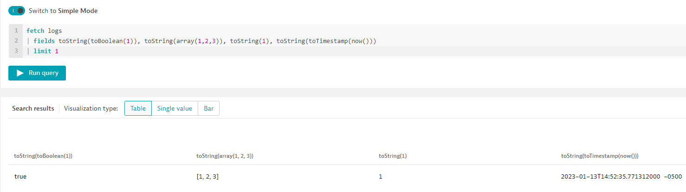
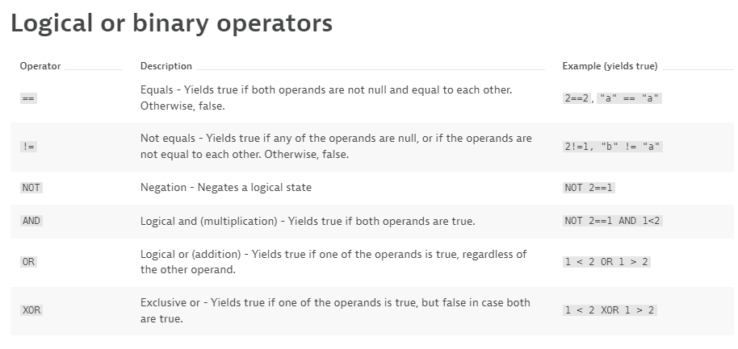
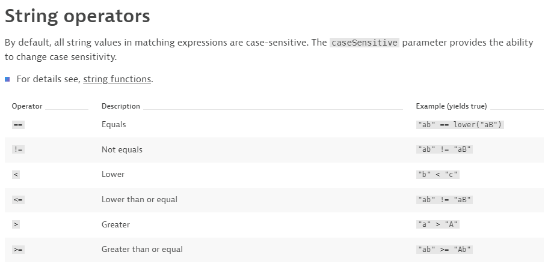
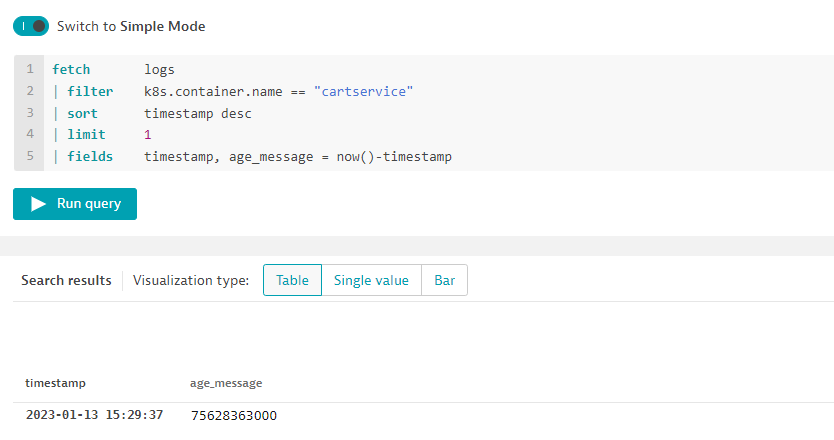
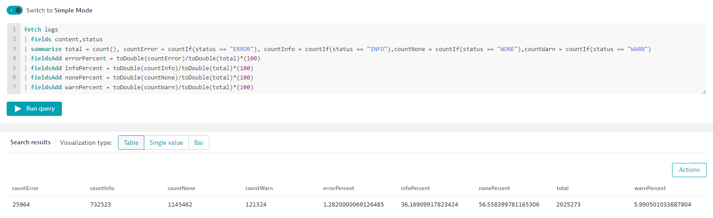

## Calculations

Within your queries there will be cases where you will want to perform some calculations on the different fields within your data (ex. myField1 + myField2). This lab is designed to provide example of how to perform different calculations using DQL.

### DQL Types

Before we do calculations we should spend a few minutes on the different data types of DQL.

### **Boolean**

Has only two possible values: `true` and `false`. It can be expressed using either uppercase or lowercase latters: `true`, `TRUE`, `false`, `FALSE`

**Exercise: Converting a string to a boolean**

Convert the following values to Booleans using the `toBoolean()` function:

<ul>"true"</ul>
<ul>"TrUe"</ul>
<ul>"1"</ul>
<ul>3</ul>
<ul>"test"</ul>
<ul>0</ul>

    
Solution

 
`   fetch logs
    | fields toBoolean("true"), toBoolean("TrUe"), toBoolean("1"),toBoolean(3), toBoolean("test"), toBoolean(0)
    | limit 1
  `

**Note:**

- Converts string values `true`, `TRUE` to a `true` Boolean value, and other values to `false`
- Converts numeric value `0` to Boolean `false`. Converts other numeric values to Boolean `true`

### **Long**

The signed long has a minimum value of -2^63 and a maximum value of 2^63-1

**Exercise: Converting to Long**

Convert the following values to Long using the `toLong()` function:

<ul>"1598163"</ul>
<ul>"0.9"</ul>
<ul>0.9</ul>
<ul>123.4</ul>
<ul>"test"</ul>

    
Solution

 
`   fetch logs
    | fields toLong("1598163"), toLong("0.9"), toLong(0.9),toLong(123.4), toLong("test")| limit 1
  `

**Note:**

- A Long value **cannot** contain a decimal
- Converting a decimal value to a Long will result in the decimal places being removed

### **Double**

Double-precision 64-bit IEEE 754 floating point. (i.e. can contain decimals)

**Exercise: Converting to Double**

Convert the following values to Long using the `toDouble()` function:

<ul>"1598163"</ul>
<ul>"0.9"</ul>
<ul>0.9</ul>
<ul>123.4</ul>
<ul>"test"</ul>

    
Solution

 
`   fetch logs
    | fields toDouble("1598163"), toDouble("0.9"), toDouble(0.9), toDouble(123.4), toDouble("test")
    | limit 1
  `

### **String**

Double-precision 64-bit IEEE 754 floating point. (i.e. can contain decimals)

**Exercise: Converting to String**

Convert the following values to Long using the `toString()` function:

<ul>A Boolean value of 1</ul>
<ul>an array of 1,2,3</ul>
<ul>1</ul>
<ul>the current timestamp</ul>

    
Solution

 
`   fetch logs
    | fields toString(toBoolean(1)), toString(array(1,2,3)), toString(1), toString(toTimestamp(now()))
    | limit 1
  `

**Note:**

- All DQL datatypes can be converted to a string

---

## Operators

The types `long`, `double` and `timestamp` real represent numerical data types the following can be used with pairs of these types

source: https://www.dynatrace.com/support/help/shortlink/dql-operators#numerical-operators

source: https://www.dynatrace.com/support/help/shortlink/dql-operators#logical-or-binary-operators

source: https://www.dynatrace.com/support/help/shortlink/dql-operators#string-operators

---

## Calculation examples

Let's try some calculation exercises

1. Find how long until the last log record for the container `cartservice` was received

    
Solution

 
`   fetch       logs
    | filter    k8s.container.name == "cartservice"
    | sort      timestamp desc
    | limit     1
    | fields    timestamp, age_message = now()-timestamp
  `

**Extra Credit:**
 
Calculate the percent of logs received for the status types `ERROR`, `WARN`, `INFO`, `NONE` over the past 30 minutes

    
Solution

 
`   fetch logs
    | fields content,status| summarize total = count(), countError = countIf(status == "ERROR"), countInfo = countIf(status == "INFO"),countNone = countIf(status == "NONE"), countWarn = countIf(status == "WARN")
    | fieldsAdd errorPercent = toDouble(countError)/toDouble(total)*(100) 
    | fieldsAdd infoPercent = toDouble(countInfo)/toDouble(total)*(100) 
    | fieldsAdd nonePercent = toDouble(countNone)/toDouble(total)*(100) 
    | fieldsAdd warnPercent = toDouble(countWarn)/toDouble(total)*(100)
  `

