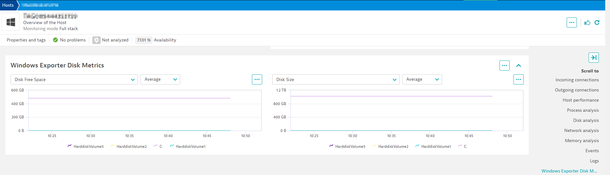

## Visualizing the data collected 

### `screens:` section

In the yaml file, the screens section defines the different unified analysis pages to visualize the data that your extension collects. More details are available [here](https://www.dynatrace.com/support/help/shortlink/ua-pages).

### Extending built-in unified analysis pages 

Because we are designing this prometheus extension to run locally, the metrics that are ingested by the extension are will already be enriched with the host dimensions from which this OneAgent is running on. We only need then to define the cards to be injected in order to see these new metrics show up on the Host screen. More details are available [here](https://www.dynatrace.com/support/help/shortlink/extend-ua-pages)

Since we'd like these metrics to be on the details page, we are going to define a `detailsInjection` section. 

```yaml
screens:
  - entityType: HOST
    detailsInjections:
          - type: CHART_GROUP
            key: prometheus_windows_exporter_metrics
            conditions:
              - entityAttribute|osType=WINDOWS
```

This section is saying that if the HOST Operating System is Windows then we'd like to inject a CHART GROUP Card with the key `prometheus_windows_exporter_metrics`. 

Next we'd need to define what that CHART GROUP looks like. To do that, we need to add a `chartsCards:` section.

```yaml
    chartsCards:
      - key: prometheus_windows_exporter_metrics
        numberOfVisibleCharts: 2
        chartsInRow: 2
        displayName: Windows Exporter Disk Metrics
        charts:
          - displayName: Disk Free Space
            visualizationType: GRAPH_CHART
            graphChartConfig:
              metrics:
                - metricSelector: windows_logical_disk_free_bytes:splitBy("volume")
          - displayName: Disk Size
            visualizationType: GRAPH_CHART
            graphChartConfig:
              metrics:
                - metricSelector: windows_logical_disk_size_bytes:splitBy("volume")
```

All together the `screens:` section would look like this. 

Note: Multiple CHART_GROUP's or other types of cards can be injected. This example only does one. 

```yaml
screens:
  - entityType: HOST
    detailsInjections:
          - type: CHART_GROUP
            key: prometheus_windows_exporter_metrics
            conditions:
              - entityAttribute|osType=WINDOWS
    chartsCards:
      - key: prometheus_windows_exporter_metrics
        numberOfVisibleCharts: 2
        chartsInRow: 2
        displayName: Windows Exporter Disk Metrics
        charts:
          - displayName: Disk Free Space
            visualizationType: GRAPH_CHART
            graphChartConfig:
              metrics:
                - metricSelector: windows_logical_disk_free_bytes:splitBy("volume")
          - displayName: Disk Size
            visualizationType: GRAPH_CHART
            graphChartConfig:
              metrics:
                - metricSelector: windows_logical_disk_size_bytes:splitBy("volume")
```

