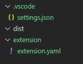

## Basic structure

Let's start by creating our extension directories.

1. Create a folder called `mysql` on the directory of your choice, open it on vscode
2. Hit F1, search for `Dynatrace: initialize workspace`
3. Hit enter, chose schema version `1.250`

Note how the Dynatrace Copilot extension will create the basic files for you.

