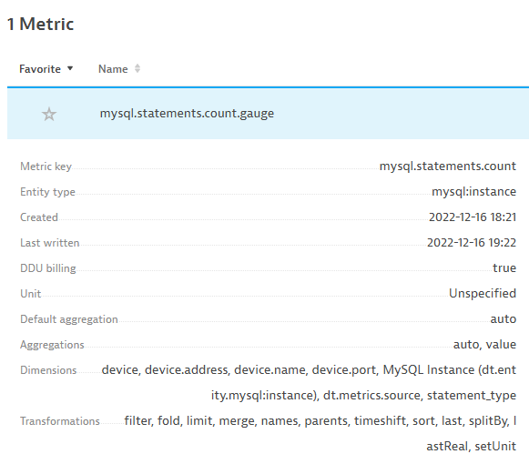
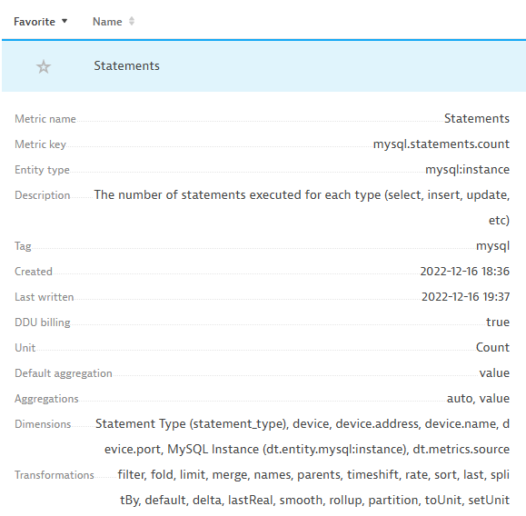

## Metadata

Our extension works as it is, but the next step is to add metadata.  
We can help our users understand more about our metrics with metric metadata.

Add a `metrics` session to the yaml.  
We only have one metric, but extensions usually have many.


```yaml
metrics:
  - key: mysql.statements.count
    metadata:
      displayName: Statements
      description: The number of statements executed for each type (select, insert, update, etc)
      unit: Count
      dimensions:
        - key: statement_type
          displayName: Statement Type
      tags:
        - mysql
```

Note that this is optional, but it makes for a better user experience.

A metric without metadata:



A metric with metadata:



The metadata can be used in other places, like dashboards, data explorer and alerts.