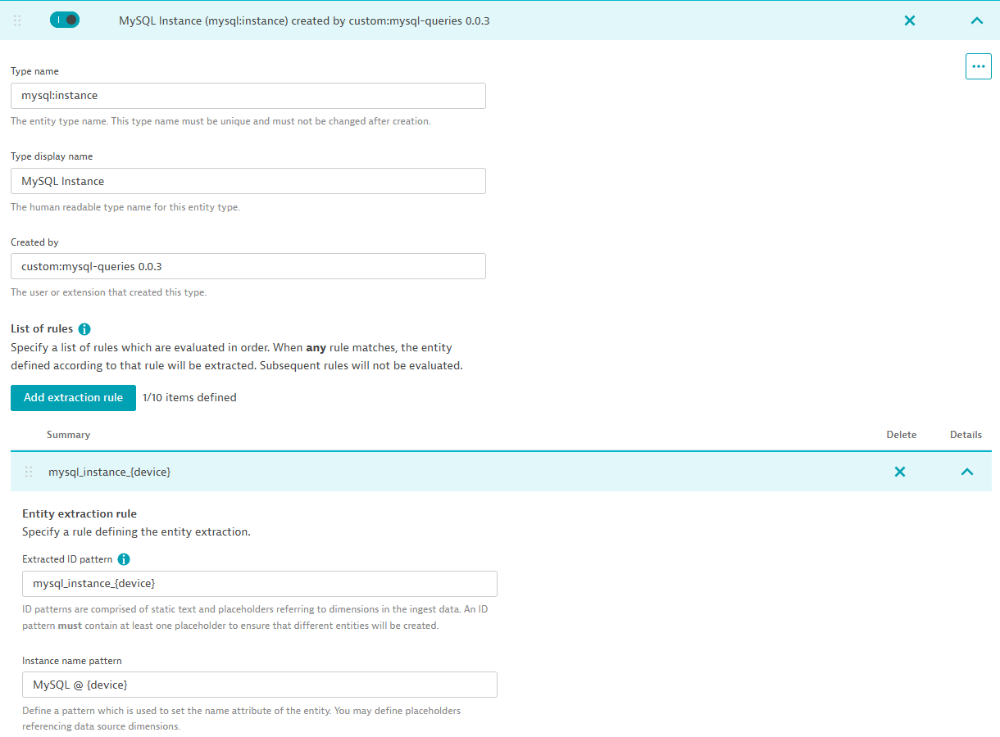

## Topology

One of the nicest features of Extensions 2.0 is being able to define the topology for our metrics.  
We have a MySQL Instance in our extension, so let's define rules of how Dynatrace should create it. 


```yaml
topology:
  types:
    - name: mysql:instance
      displayName: MySQL Instance
      rules:
        - idPattern: mysql_instance_{device}
          instanceNamePattern: MySQL @ {device}
          iconPattern: database
          sources:
            - sourceType: Metrics
              condition: $prefix(mysql.)
```

This bit of yaml is using a Dynatrace feature that can also be accessed via the UI under `Settings > Topology Model`.  
Extensions allow you to create this configuration declaratively, which is a great way to manage it.




Let's break down the configuration:

- `name`: This is the internal name of this entity type, just like we have `host`, `process_group_instance`, `custom_device` we now have a `mysql:instance` type.
- `displayName`: This is the friendly name that will be displayed in the UI.
- `rules` - A list of rules telling Dynatrace how to create this entity. This can be done via metrics, logs, spans, etc.


This concept is specially important when we start introducing new entities.  
For instance, if we had a `database` entity, and we want it to have a relationship with the `instance` entity, we would have rules that also create an instance out of metric lines that have `database` metrics.

Example, both of these metric lines would create an `instance` entity with the rule we defined above.
The first metric line could also create a `database` entity (if we have a rule for it).

```
mysql.database.size,device=server1,database=database1 20
mysql.statements.count,device=server1,statement=select 50
```


