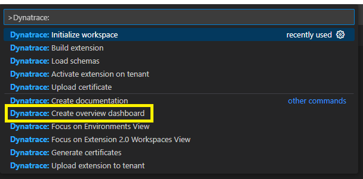
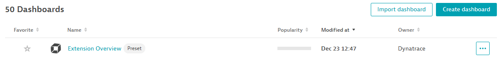

## Overview Dashboard

The Dynatrace Copilot Extension has a handy feature that allows you to create a overview dashboard for your extension.  
The only requirement is that you have your topology and metrics defined.

Press `F1` or `Ctrl + Shift + P` and search for `Dynatrace: Create overview dashboard` and press `Enter`.



This will create a dashboards folder, and an overview dashboard inside of it:


The copilot extension automatically adds the `dashboards` section to our yaml:

```yaml
dashboards:
  - path: dashboards/overview_dashboard.json
``` 

If we have fast mode enabled, and save the file, the dashboard will be created in Dynatrace. 



There is no data because we haven't deployed our extension quite yet.  