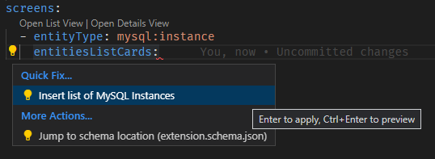
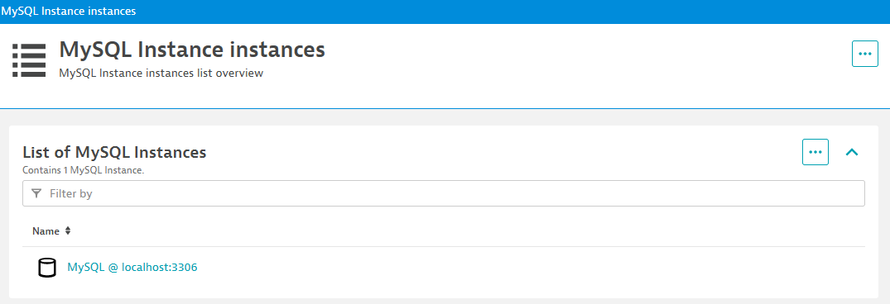
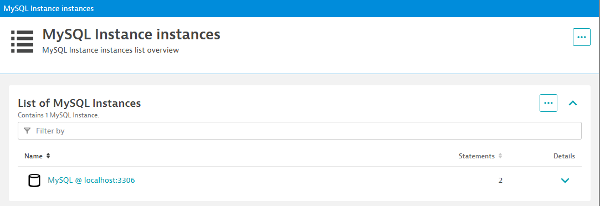

## Screens

The yaml element `screens` allow us to declare `Unified Analysis Screens` for our entities.  
This is a powerful feature, and it is the same technology behind other screens in Dynatrace like the `HOST` screen.  


The Dynatrace Copilot Extension has a handy feature that allows you to automate a significant portion of the screen creation.  


### Entity List Screens

There is a special type of screen, that defines how the list of a certain entity is displayed in Dynatrace.  
Let's create one for our `mysql:instance` entity.

Create a yaml element called `screens`, set `entityType` to `mysql:instance`.   
Add an element called `entitiesListCards`, you will see a light bulb appear to the right of the element.  

Clicking that lightbulb will allow you to automaically define a card for the list of mysql instances.




This is the result:

```yaml
screens:
  - entityType: mysql:instance
    entitiesListCards:
      - key: mysqlinstance_list_self
        pageSize: 15
        displayName: List of MySQL Instances
        displayCharts: false
        enableDetailsExpandability: true
        numberOfVisibleCharts: 3
        displayIcons: true
        hideEmptyCharts: true
        filtering: 
              entityFilters:
                - displayName: Filter by
                  filters:
                    - type: entityName
                      displayName: Name
                      freeText: true
                      modifier: contains
                      defaultSearch: true
                      distinct: false
                      entityTypes:
                        - mysql:instance
        columns: []
        charts: []
```

Note that Dynatrace Copilot created an `entityListCard` for us, but we still need to instruct our screen to use it.  
To do so, add the `listSettings` element to our screen definition, and add the created card to the layout as an `ENTITIES_LIST`.  
Note that on this same element you can also edit things like the title of the screen.  

```yaml
screens:
  - entityType: mysql:instance
    listSettings:
      staticContent:
        showGlobalFilter: true
      layout:
        autoGenerate: false
        cards:
          - type: ENTITIES_LIST
            key: mysqlinstance_list_self
    
    entitiesListCards:
      - key: mysqlinstance_list_self
        pageSize: 15
        displayName: List of MySQL Instances
        displayCharts: false
        enableDetailsExpandability: true
        numberOfVisibleCharts: 3
        displayIcons: true
        hideEmptyCharts: true
        filtering: 
              entityFilters:
                - displayName: Filter by
                  filters:
                    - type: entityName
                      displayName: Name
                      freeText: true
                      modifier: contains
                      defaultSearch: true
                      distinct: false
                      entityTypes:
                        - mysql:instance
        columns: []
        charts: []
```

This empty card will produce a list of entities without any interesting data about them when you navigate to `/ui/entity/list/mysql:instance`:




We can add our metric to this card, by modifying the `charts` element of our card definition.


Replace the `charts` element with the following:

```yaml
        charts: 
          - displayName: Chart
            visualizationType: GRAPH_CHART
            graphChartConfig:
              metrics:
                - metricSelector: mysql.statements.count
```

The screen will now look like this:  
Note that you can also add columns for the properties and any other metrics you want to display.

