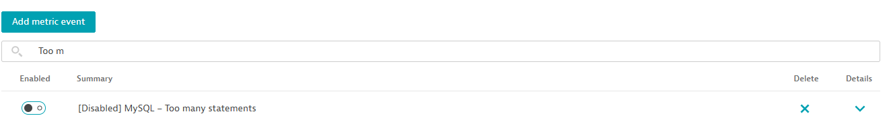

## Alerts

You can add alerts to your extension with JSON files.  
This is similar with how the dashboard creation was done.

Open the vscode command pallete by pressing `Ctrl+Shift+P` (or `F1`) and find `Dynatrace: Create alert`

1. Select a metric from the dropdown
2. Input a name for this alert, like `MySQL: Too many statements`
3. Select the threshold condition (`Above` or `Below`)
4. Input a threshold value

Copilot will automatically perform the actions:

1. Create a new alert in the `alerts` folder
2. Add a reference to the file under the alerts section of `extension.yaml`

```yaml
alerts:
  - path: alerts/alert-001-mysql-too-many-statements.json
```

These two steps can also be manually performed, and you can feel free to modify the contents of the auto-generated file.

When you hit Save (if you have `Fast Mode Enabled`) the new Alert can be found in Dynatrace under `Settings, Anomaly Detection, Metric Events`




