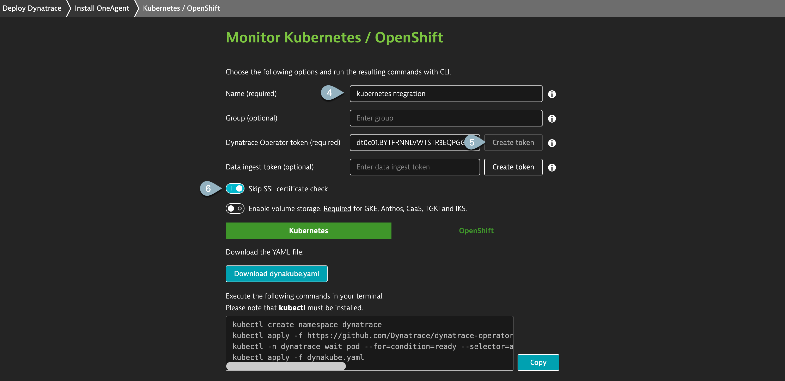
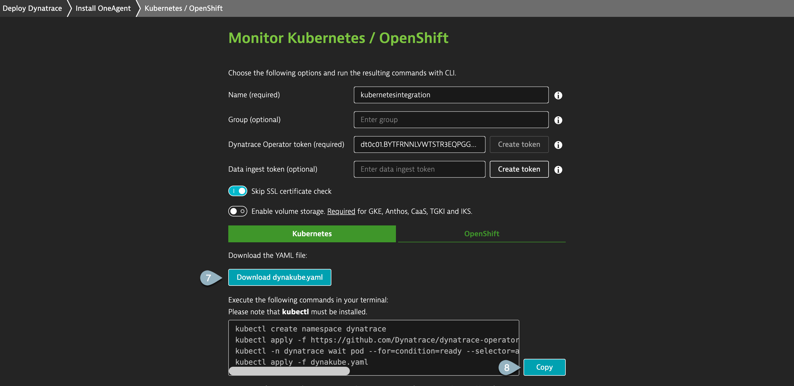
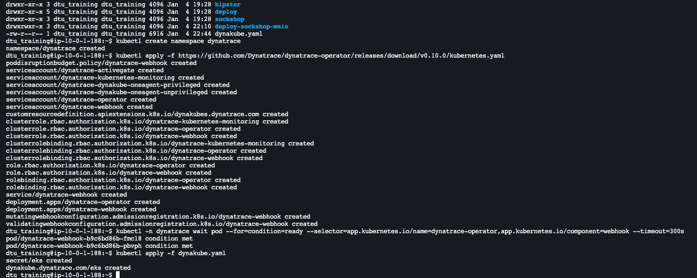

## Deploy Operator

Let's start the deployment by navigating to the Dynatrace menu and search for **Kubernetes**.
1. At the Kubernetes screen, click on **Connect automatically via Dynatrace Operator**

2. On the **Monitor Kubernetes / OpenShift** page, follow the on-screen deployment instructions:
    - **Name**: This name is used by various Dynatrace settings including: Kubernetes cluster name, Network Zone, ActiveGate Group, and Host Group.
    - **Dynatrace Operator token & Data Ingest token**: To create these tokens automatically, select **Create tokens**.
    - Enable **Skip SSL Certificate Check**.
    - Click on **Download dynakube.yaml** to download dynakube.yaml locally.
    - Copy the contents within dynakube.yaml via a local file editor.
    - **Create** a new file in the terminal with `vim dynakube.yaml`
    - **Paste the content** into the created dynakube.yaml
    - Exit the file dynakube.yaml by pressing `Crtl` + `x` together and followed by `Y` to save the file and `Enter`
    - Lastly, execute the commands within the installation screen

**Note**: The downloaded dynakube.yaml will automatically include the autogenerated tokens from step 2. 

**Note**: Be sure to execute the commands in the same directory where you downloaded the YAML, or adapt the commands to link to the location of the YAML.

This should enable the kubernetes intrumentation for your cluster. To view the integration, click on **Show deployment status.**
