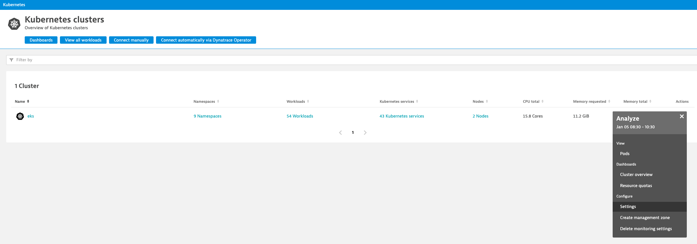
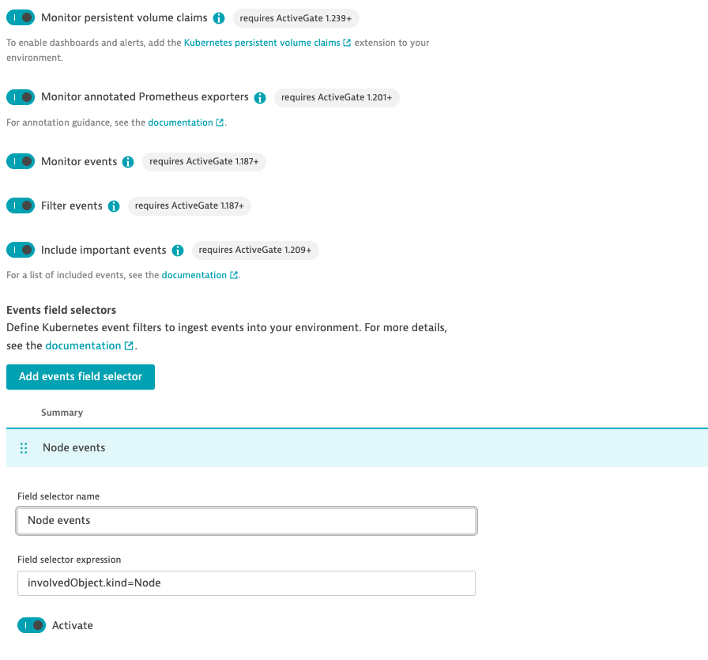

## Enable Kubernetes Settings

To monitor additional elements of the kubernetes cluster, follow the following steps below:

1. Within the Kubenetes page, with the kubenetes cluster, under Actions on the right, click on **"..."**, select **Settings**

    

2. Under Monitoring settings, enable the following toggles:
   - Toogle On **Monitor annotated Prometheus exporters**
   - Toogle On **Monitor events**
   - Toogle On **Filter events**
   - Toogle On **Include important events**
   - Click on **Add events field selector** 

    
