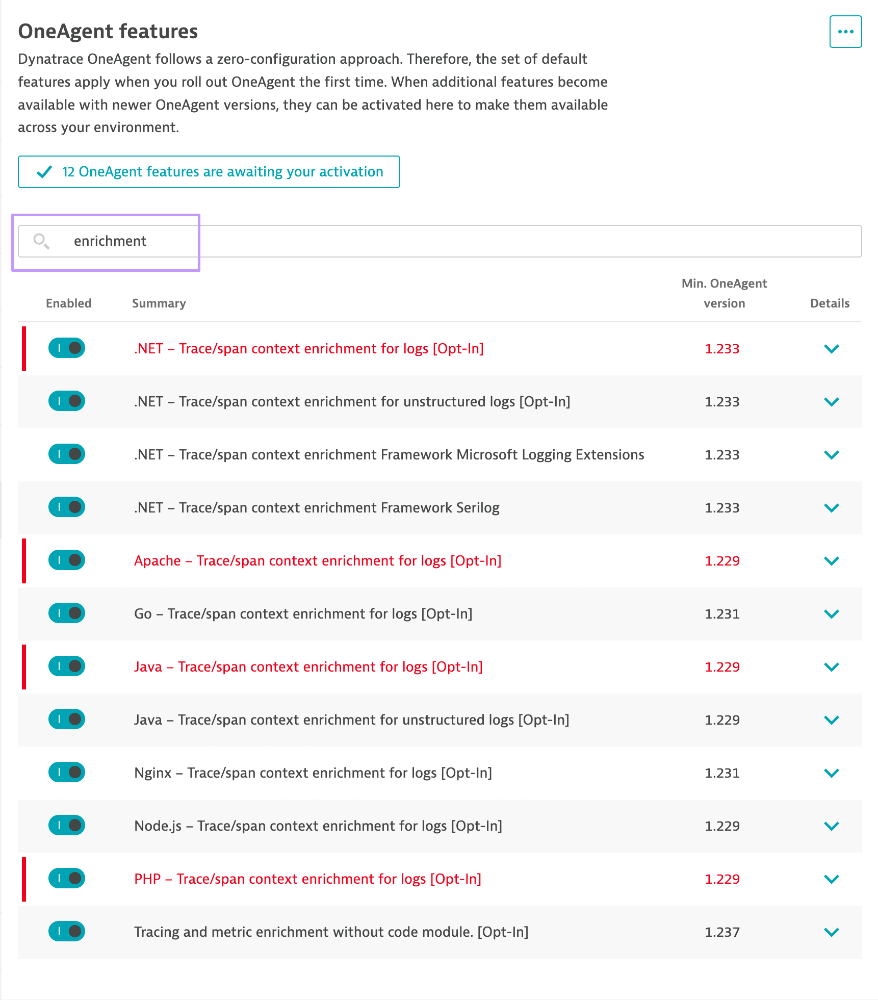
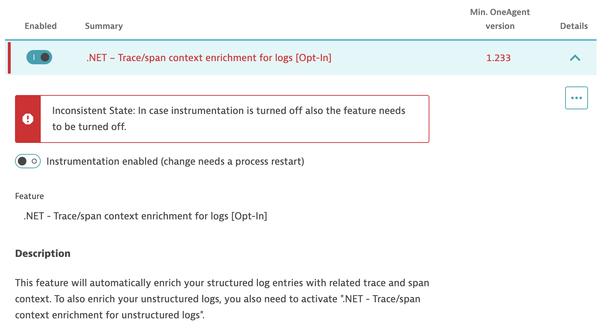

## Enable Log Enrichment

To allow us to view traces and user session on a later lab, we will enable the enrichment for the logs.

1. Within the **Settings** page, go to **Preferences** and then **OneAgent features** 

2. Search for `enrichment` on the filter bar 

    

3. Enable all toggles for **ALL** features

4. Click on **Save**

5. For those features that flagged out as red, make sure you are expanding to **toggle on** instrumentation enabled (change needs a process restart) 

    
