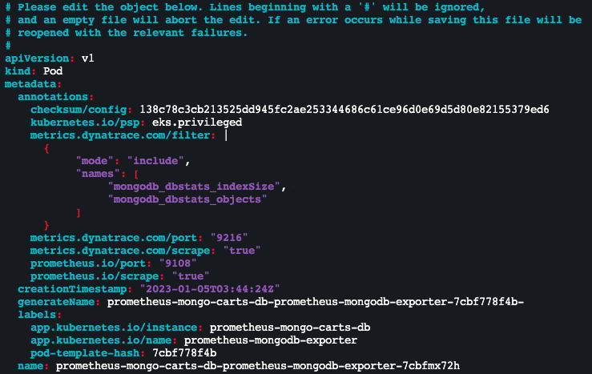

## Filter Prometheus Metrics

In this step, we will annotate the exporters so that the OneAgents only pull specific Prometheus metrics and push them to the Dynatrace tenant.

By default, all of the metrics collected by the annotated exporter(s) will be pulled into Dynatrace. 
- However, you can limit the metrics by annotating the pod with an optional filter key as below:

```
metrics.dynatrace.com/filter: |
      {
      "mode": "include",
      "names": [
            "metrics-name-1",
            "metrics-name-2",
            "metrics-name...n"
      ]
      }
```
      - **Note**: Replace the metrics-name-1, metrics-name-2, etc. with the appropriate key of the metrics you would like pulled in by Dynatrace.
  
- Now, let's annotate our mongodb-exporter to limit our collection of metrics to two:
      - mongodb\_dbstats\_indexSize
      - mongodb\_dbstats\_objects

- Replace **pod_name** with the mongodb-exporter pod name:
      
      ```
      kubectl edit pod pod_name
      ```
- Add the below section to the pod's yaml (be careful with spacing here):

```
metrics.dynatrace.com/filter: |
      {
            "mode": "include",
            "names": [
                  "mongodb_dbstats_indexSize",
                  "mongodb_dbstats_objects"
            ]
      }
```



- Once added, press **ESC + :wq** to quit the editor. The pod is now annotated with the filtered metrics you will receive in Dynatrace.

      - **Note**: mode supports both **include** and **exclude** keywords. Also, the names accept wildcard like mongo* should you have multiple metrics with similar text patterns.
