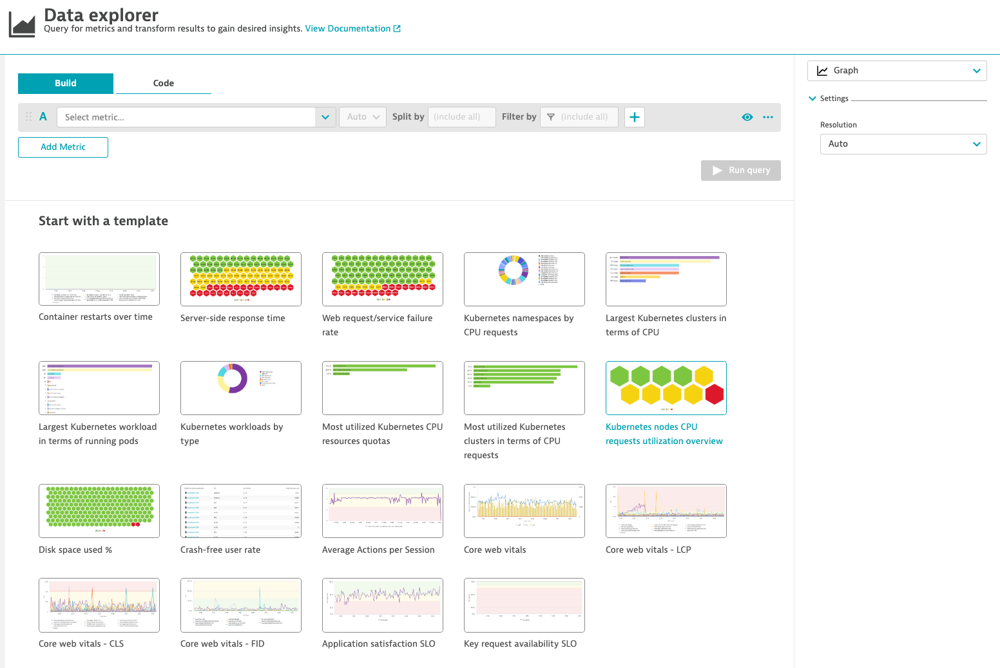
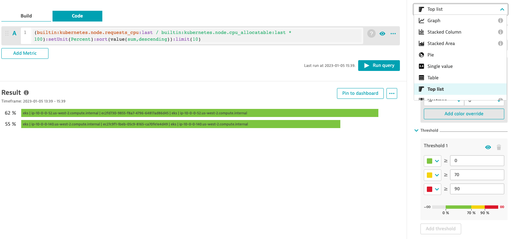
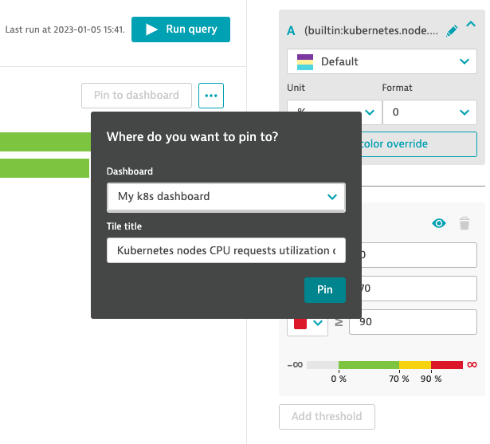

## Create a dashboard

In this step, we will create our own Kubernetes dashboard using metrics we've seen in the previous steps.

1. Navigate to the **Dashboards** page and select **Create dashboard**
      - Enter a dashboard name (ex. _My K8s Dashboard_) and click **Create**

2. Drag & drop a **Graph** tile onto the dashboard
      - Select **Configure tile in Data Explorer**

3. Choose a metric template
      - Select **Kubernetes nodes CPU requests utilization overview** template

      - Change the dropdown selection at the top right to **Top list**

      - Select **Pin to dashboard**

4. **Result**

5. Go through these steps again
      - This time utilize **different metrics** and **templates**.
          - Example metrics:
              - mongodb\_dbstats\_indexSize
              - builtin:kubernetes.workload.pods_desired
              - builtin:containers.cpu.usagePercent
              - builtin:kubernetes.node.memory_allocatable

