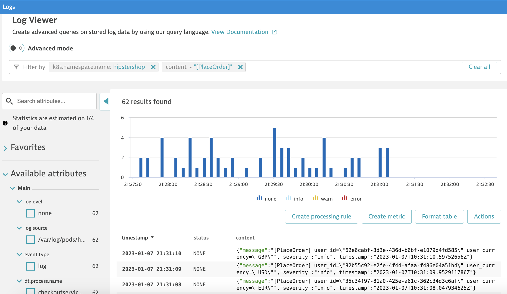
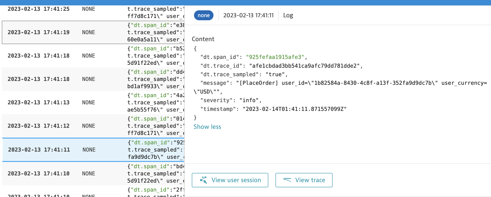
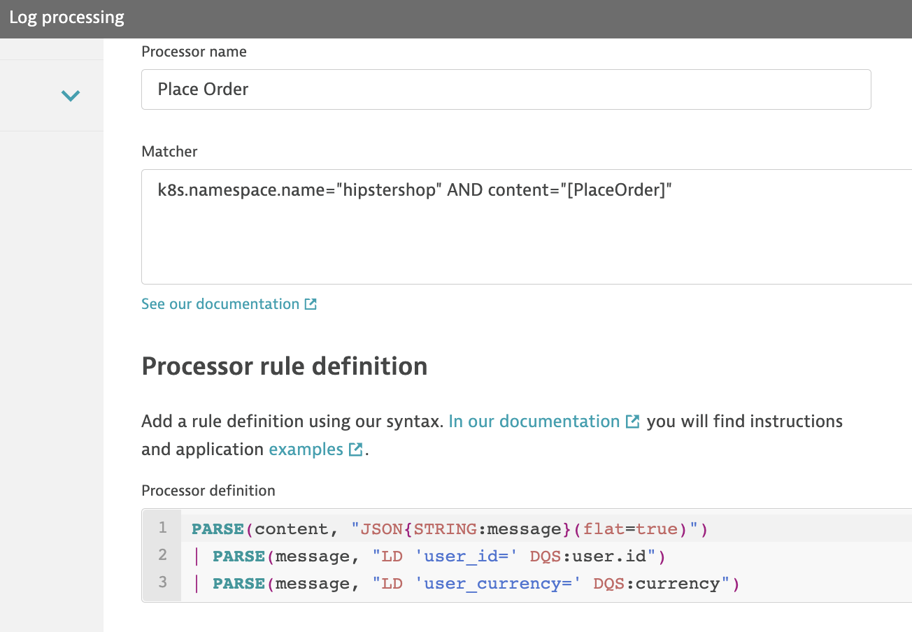

## Create Log Processing Rule

In this step, we will create a log processing rule based on log content.

1. Navigate to the **Logs** page

    

2. Filter for **k8s.namespace.name="hipstershop"** and **content: "[PlaceOrder]"**



3. When expanding out on single log row, you can click view log entries that are linked to user sessions and traces. Click on **View user session** and **View trace** to explore. 



3. Click on the **Create Processing Rule** button

4. Under the Processor name, enter in **Place Order**

5. Under Processor rule definition, use the following:

```
PARSE(content, "JSON{STRING:message}(flat=true)") 
| PARSE(message, "LD 'user_id=' DQS:user.id")
| PARSE(message, "LD 'user_currency=' DQS:currency")
```

6. Click on **Download sample log** to retrive a sample log entry of filtered rule

7. Click on **Test the Rule** to view test results 

* Note You should see new parsed out attributes filtering out `user.id` and `currency`

6. Click on **Save changes**




