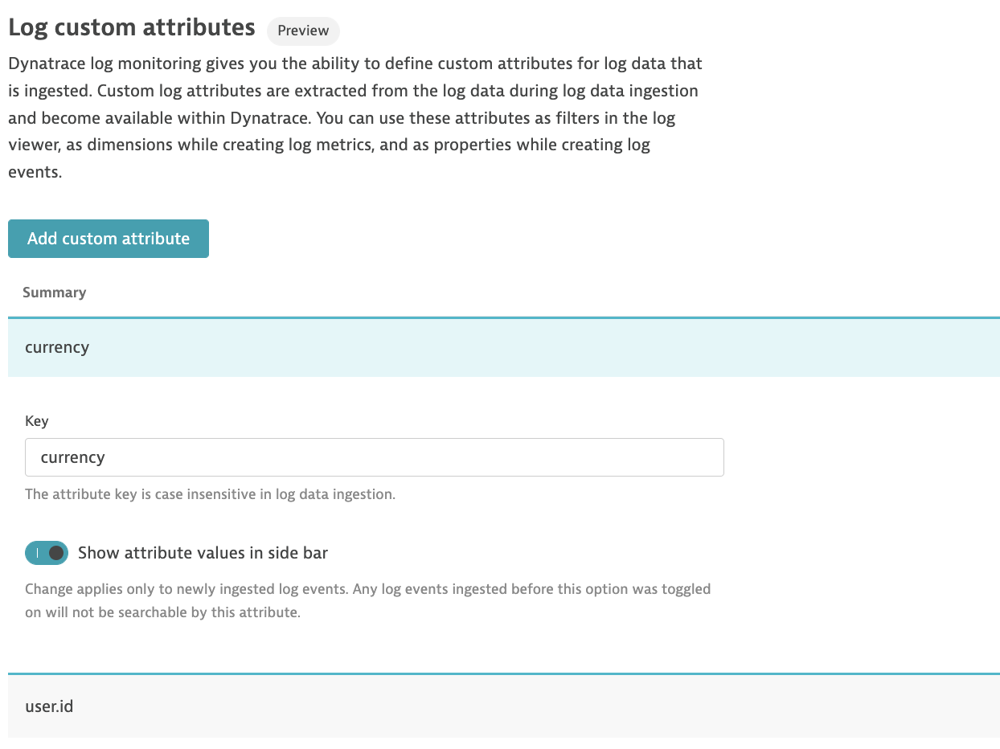
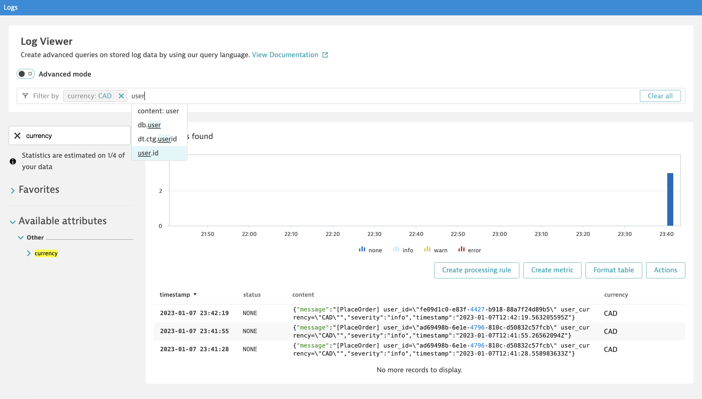

## Create Log Custom Attribute

In this step, we will create log custom attributes. Defining custom attributes allows us to filter them within the Log Viewer.

1. Navigate to **Settings** > **Log Monitoring** > **Log Custom Attributes**

2. Click on **Add custom attribute** 

3. Define the same keys ( `currency` and `user.id` ) as per previous exercise

4. Toggle on **Show attribute values in side bar**

5. Back on Log Viewer, you can now filter based on the newly created attributes.

