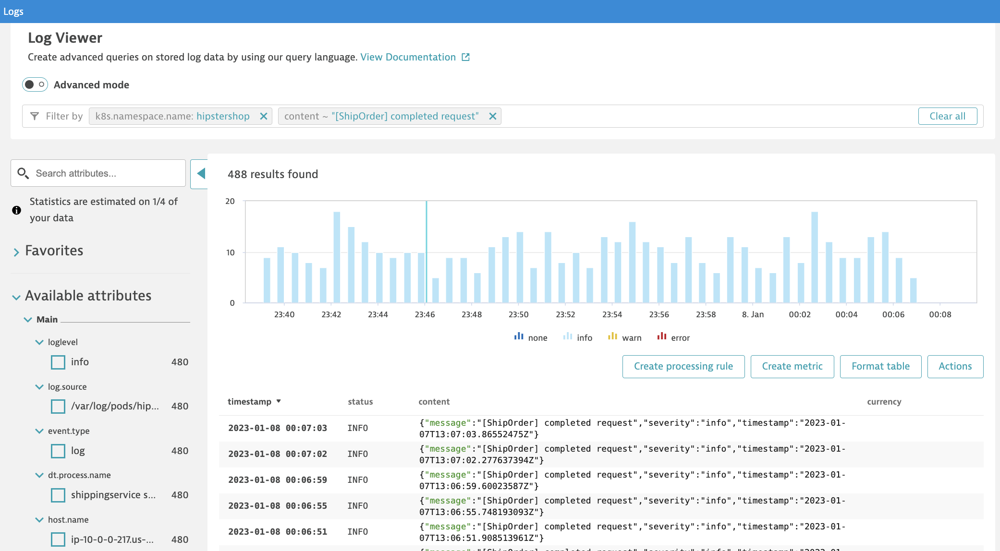
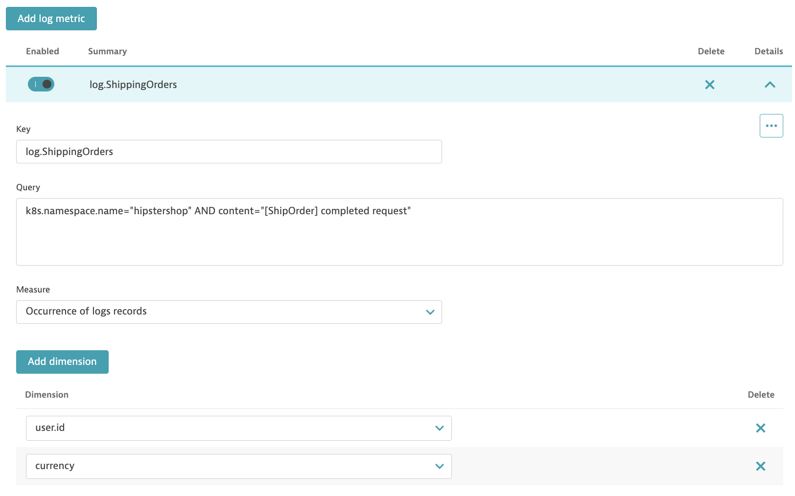

## Create metric

In this step, we will create a metric based on log content.

1. Navigate to the **Logs** page

2. Filter for **k8s.namespace.name: hipstershop** and **content: [ShipOrder] completed request**

3. Click on the **Create metrics** button
4. Add *key* **log.ShippingOrders**
5. Add dimension **currency** and **user.id**
6. Click on **Save changes**

