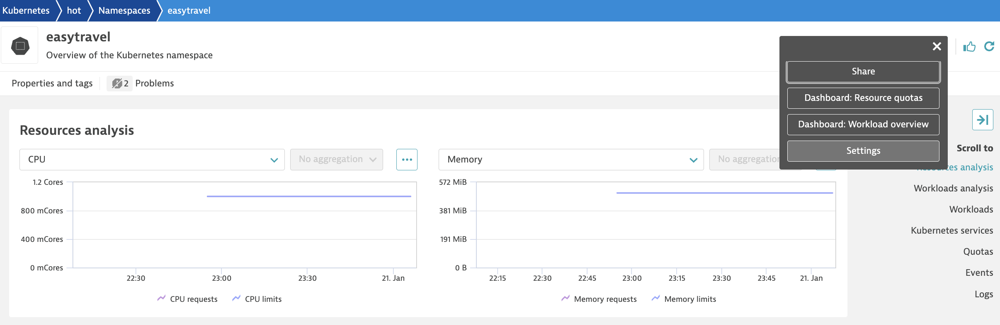
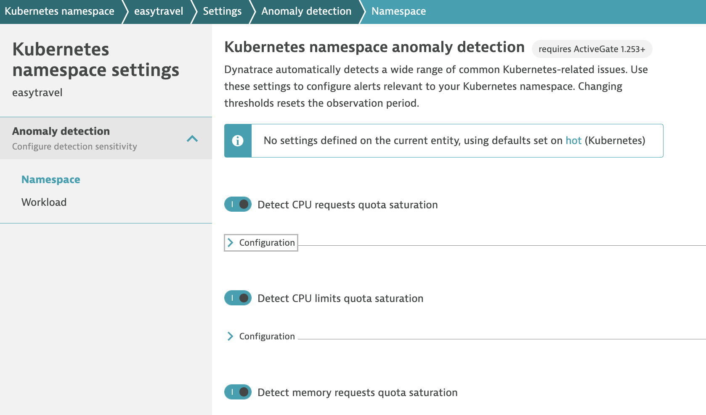
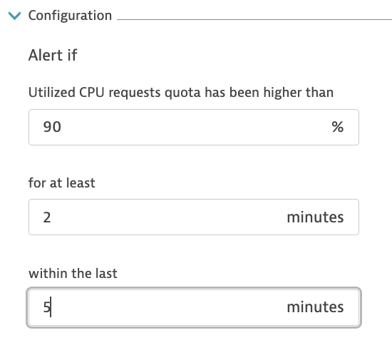
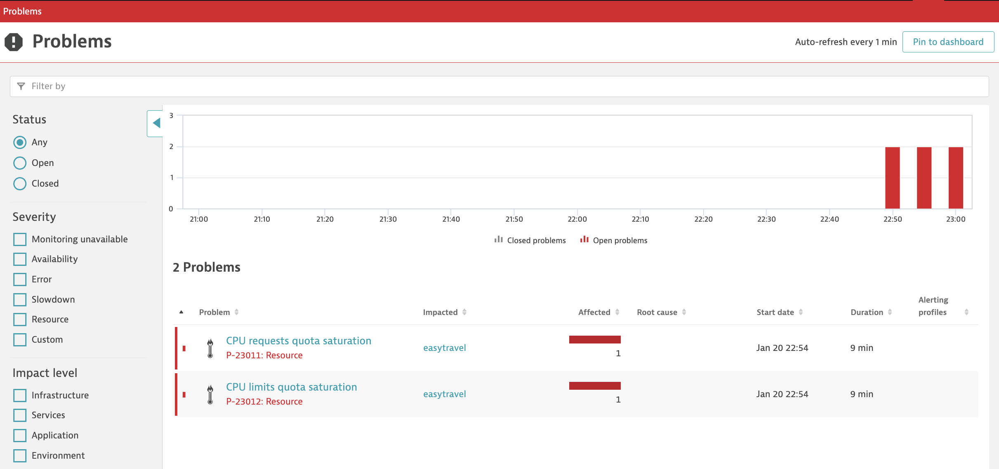
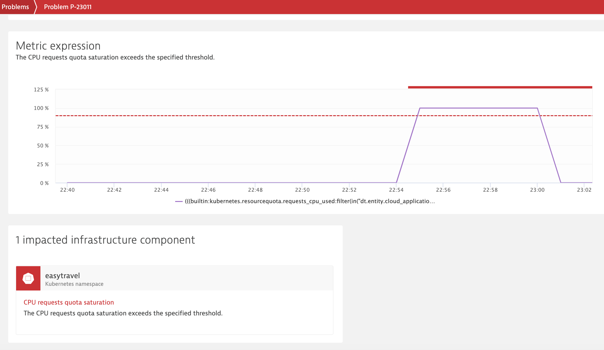

## Triggering Kubernetes Alerts

You can now also easily trigger alerts on common kubernetes platform issues via toggles.

Let's start by making changes to the turning on the toggles.

1. Go to **Kubernetes namespaces** and filter on `Namespace: easytravel`  

2. Click on **easytravel** and drill into the namespace view

3. Within the namespace view, click on [...] on the top right hand corner. Click on **Settings**


4. Within the Settings page, toggle **ON** for the below
   - **Detect CPU requests quota saturation**
   - **Detect CPU limits quota saturation**



5. You can also further define the alerting window to speed up the alerting. We're using at least 2mins with 5mins window.



6. Back at the terminal window, run the following command:

This will impose a resource quota on the easytravel namespace.

```
wget https://raw.githubusercontent.com/Nodnarboen/HOT2023/main/compute-resources-quota.yaml
kubectl apply -f compute-resources-quota.yaml
```

We will then bounce the easytravel-backend pod so it picks up on this new resource quota.

`kubectl delete po -l app=easytravel-backend -n easytravel`

We will also neeed to define a **Limit Range** definition for the easytravel namespace. To make things faster, we're deleting the replicaset to force a new one and precede the pod scheduling.

```
wget https://raw.githubusercontent.com/Nodnarboen/HOT2023/main/compute-limitrange.yaml
kubectl apply -f compute-limitrange.yaml
kubectl delete rs -l app=easytravel-backend -n easytravel
kubectl get po -n easytravel -w
```

6. You will soon see problems automatically picked up by Dynatrace based on the alerts that you specified. 

Go to **Problems** on the left navigation bar and select the CPU request quota and limit quota problems automatically detected by Dynatrace.  




