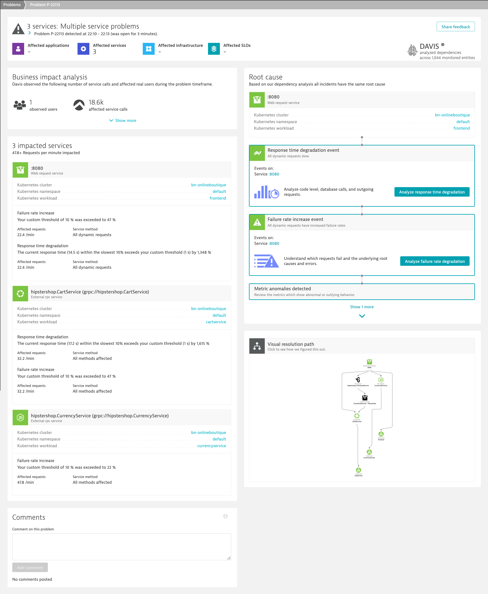

## Dynatrace DAVIS AI

Even though Dynatrace could automatically ingest metrics across all observability forms (Metrics / Traces / Logs), the real magic in our software intelligence platform is in Dynatrace DAVIS. The causal correlation analysis seamlessly combines topological context with metric data to quickly identify observability signals relevant to any signal behavior (for example, a spike on a chart) that you want to investigate. More details could be found [here](https://www.dynatrace.com/support/help/how-to-use-dynatrace/problem-detection-and-analysis/davis-ai-analysis/causal-correlation-analysis). 

To full understand the depth of Dynatrace's DAVIS, we will run through a problem and investigate it.

